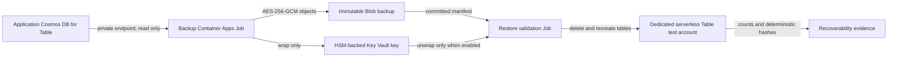
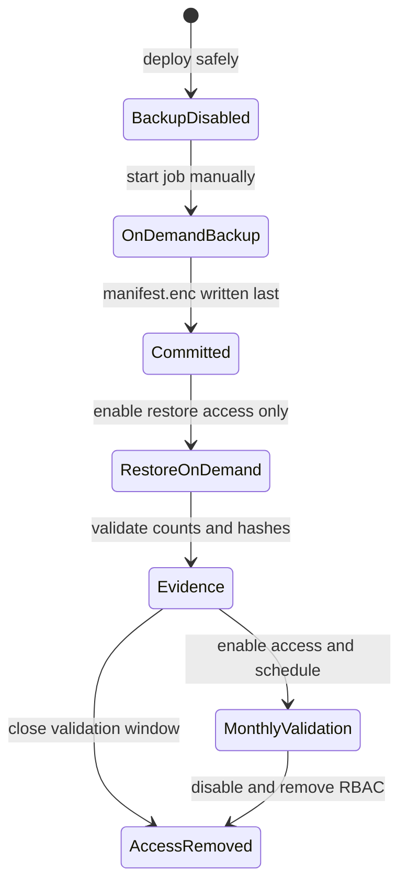

# Independent protection for Azure Cosmos DB for Table

This project provides application-level backup and recoverability evidence for an existing Azure Cosmos DB for Table account. It is an independent protection layer: the service reads through the Table data plane, preserves typed entity data in a separate subscription, and validates that a committed backup can be reconstructed. It complements—not replaces—Azure platform continuity features and an organization's wider disaster-recovery plan.

## Business value

- **Independent protection boundary.** Backup storage, identities, keys, network, jobs, and monitoring live in an isolated subscription and VNet with no peering or dependency on the application network.
- **Least-privilege data lifecycle.** The backup identity can read the source, create backup objects, and wrap a key, but cannot write source data, read/delete backups, or unwrap keys. A separate restore identity can always pull the approved job image; when restore access is enabled, it can read backups, unwrap the key, publish telemetry, and write only to the isolated validation target. It never receives source-account access.
- **Encrypted, immutable evidence.** Every run uses AES-256-GCM with a new data-encryption key wrapped by a versioned HSM-backed Key Vault key. Objects are create-only, version-level immutability is configured for seven days, and lifecycle deletion becomes eligible after 14 days. The policy is deliberately deployed unlocked until nonproduction WORM acceptance.
- **Measurable recoverability.** A restore test authenticates the backup, recreates tables, and verifies entity counts plus deterministic key/content hashes. The resulting report is evidence of recoverability without exposing entity values.
- **Controlled operation.** Backup can run on demand or on a daily UTC schedule. Restore validation can run on demand or monthly, with access and scheduling disabled by default and protected by explicit acceptance gates.

## How data moves

On each backup, the job discovers the current tables, excludes the exact case-sensitive table name `cards`, and streams each included table through typed serialization and client-side encryption. It writes the public decryption bootstrap only after all numbered table objects commit, then commits the encrypted manifest last. Only a prefix containing `manifest.enc` is a successful backup; partial runs are never restore candidates. This is a logical per-table export, not a cross-table point-in-time snapshot.

## The isolated restore target

The platform **always provisions a persistent, dedicated Azure Cosmos DB for Table test account** inside the backup boundary. Its resource identity is deterministic and separate from the source; the restore application also rejects source/target identity equality before data-plane access. The account is private, keyless, and configured in **serverless capacity mode**, so it has no fixed provisioned RU/s.

A restore execution does not create or replace this account. It removes unexpected user tables and deletes/recreates every table represented by the selected committed backup. By default, an on-demand test selects the newest committed manifest; an operator can pin a backup UUID. Monthly mode uses the same persistent account and requires both restore access and the monthly schedule to be enabled. Test-data cleanup, removal of lingering conditional RBAC assignments, and eventual account teardown are operator-owned. This target is exclusively for isolated validation—do not treat this workflow as restore to production.

## Protection lifecycle

## Start here

| Goal | Guide |
|---|---|
| Understand prerequisites, OIDC, environments, workflows, and first deployment | [Deployment and CI/CD](docs/deployment.md) |
| Run, accept, monitor, troubleshoot, or clean up backup/restore operations | [Backup and restore runbooks](docs/operations.md) |
| Understand the authoritative wire format, encryption, completion marker, and restore protocol | [Backup format v1](docs/backup-format.md) |
| Review release-blocking trust and access invariants | [Security invariants](docs/security.md) |
| Inspect Bicep composition, platform gates, and resource-level contracts | [Infrastructure reference](infra/README.md) |

Backup and restore schedules remain disabled until their separate acceptance gates pass. Follow the [deployment guide](docs/deployment.md) before operating the [runbooks](docs/operations.md).
