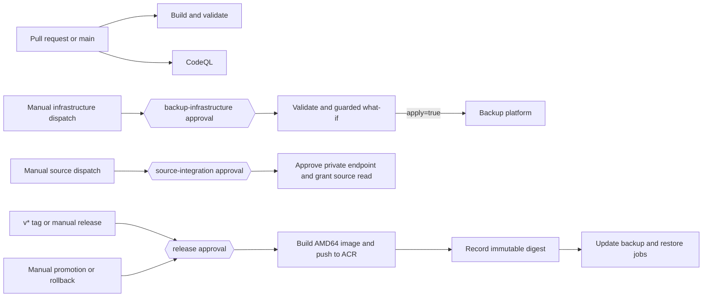
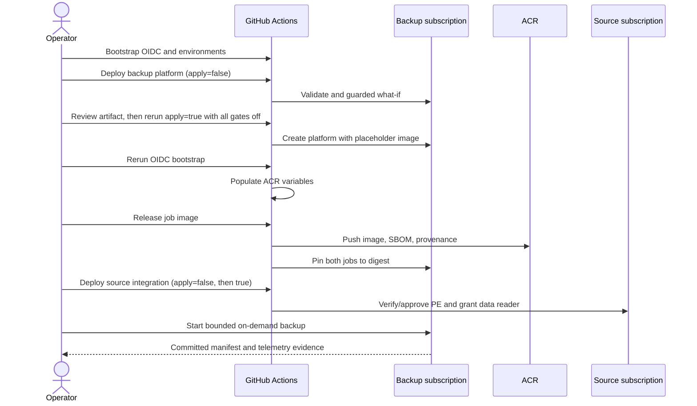

# Deployment and CI/CD guide

This guide takes a new maintainer from an empty Azure/GitHub integration to an accepted on-demand backup, then explains routine infrastructure and image delivery. For runtime procedures, continue with the [backup and restore runbooks](operations.md). For resource-level detail, see the [infrastructure reference](../infra/README.md).

## Delivery model

GitHub Actions authenticates to Azure with environment-scoped OpenID Connect (OIDC) federated credentials. No Azure client secret is created. Infrastructure, source-account integration, and image release use separate managed identities and protected GitHub environments. Pull-request validation receives no Azure token.



## Prerequisites

### Azure and GitHub access

The bootstrap operator needs:

- access to both the dedicated backup subscription and the source subscription in the same Microsoft Entra tenant;
- permission to create resource groups, user-assigned managed identities, federated credentials, custom roles, and role assignments;
- sufficient source-resource-group permission to assign the narrow source integration role;
- GitHub repository administration permission; and
- authenticated `az`, `gh`, and `jq` commands.

Register `Microsoft.App`, `Microsoft.ContainerRegistry`, `Microsoft.DocumentDB`, `Microsoft.Insights`, `Microsoft.KeyVault`, `Microsoft.ManagedIdentity`, `Microsoft.Network`, `Microsoft.OperationalInsights`, and `Microsoft.Storage` in the applicable subscription. Confirm regional quota/availability for the resources described under [platform gates](../infra/README.md#deployment-prerequisites-and-platform-gates).

The source must be a Cosmos DB for Table account with public access and local authentication disabled. Run the read-only preflight before deployment:

```bash
export TARGET_SUBSCRIPTION_ID='<backup-subscription-id>'
export SOURCE_COSMOS_RESOURCE_ID='/subscriptions/<source-subscription-id>/resourceGroups/<source-rg>/providers/Microsoft.DocumentDB/databaseAccounts/<source-account>'
./scripts/preflight.sh
```

The preflight confirms same-tenant subscriptions, Table capability, source network/authentication invariants, and availability of the built-in data reader role. It does not change resources.

### Review the deployment parameters

Review `infra/parameters/nonprod.bicepparam`: globally unique naming prefix, resource group, region, nonoverlapping VNet/subnet CIDRs, storage redundancy, UTC schedules, seven-day immutability, lifecycle eligibility after 14 days, exact exclusions, alert recipients, and tags. The defaults keep both schedules and all conditional restore access off. The image value is an intentionally unusable digest-shaped placeholder for bootstrap only.

Do not put real subscription IDs, account IDs, recipients, or production settings in a public parameter file. GitHub environment variables supply deployment-specific identifiers.

## Bootstrap secretless OIDC

Export values in the operator's local shell and run the idempotent bootstrap:

```bash
export AZURE_BACKUP_SUBSCRIPTION_ID='<backup-subscription-id>'
export AZURE_SOURCE_SUBSCRIPTION_ID='<source-subscription-id>'
export SOURCE_COSMOS_ACCOUNT_RESOURCE_ID='/subscriptions/<source-subscription-id>/resourceGroups/<source-rg>/providers/Microsoft.DocumentDB/databaseAccounts/<source-account>'
export AZURE_RESOURCE_GROUP='<backup-resource-group>'
export BACKUP_PREFIX='<bicep-prefix>'
export AZURE_LOCATION='<azure-region>'
export GITHUB_REPOSITORY='<organization>/<repository>'
export DEPLOYMENT_BRANCH='main'
./scripts/bootstrap-github-oidc.sh
```

The script creates three deployment identities and federated subjects bound to this repository and their environments:

- **backup infrastructure:** Contributor, Role Based Access Control Administrator, and the custom role-definition manager at backup-subscription scope;
- **source integration:** a narrow custom deployment/private-endpoint/role-assignment role at source-resource-group scope; and
- **release:** `AcrPush` plus a custom existing-Container-Apps-job image updater at backup-resource-group scope.

It creates `backup-infrastructure`, `source-integration`, and `release`, makes the current operator the initial required reviewer, permits self-review for nonproduction, and allows the configured branch. `v*` tags are also permitted for `release` and `backup-infrastructure`. Before production, use an owning team as reviewer, prevent self-review, add wait timers where required, and restrict environment administration.

Set `CONFIGURE_GITHUB=false` to create Azure identities without changing GitHub. The first bootstrap may run before ACR exists; **rerun it after the initial platform deployment** so it discovers the registry and writes `ACR_NAME`/`ACR_LOGIN_SERVER`.

### Environment variables created

| Environment | Variables |
|---|---|
| `backup-infrastructure` | `AZURE_TENANT_ID`, `AZURE_BACKUP_SUBSCRIPTION_ID`, `AZURE_BACKUP_DEPLOY_CLIENT_ID`, `AZURE_LOCATION`, `AZURE_RESOURCE_GROUP`, `SOURCE_COSMOS_ACCOUNT_RESOURCE_ID`, `BACKUP_JOB_NAME`, and later `ACR_LOGIN_SERVER` |
| `source-integration` | `AZURE_TENANT_ID`, `AZURE_SOURCE_SUBSCRIPTION_ID`, `AZURE_SOURCE_DEPLOY_CLIENT_ID`, `SOURCE_COSMOS_ACCOUNT_RESOURCE_ID` |
| `release` | `AZURE_TENANT_ID`, `AZURE_BACKUP_SUBSCRIPTION_ID`, `AZURE_RELEASE_CLIENT_ID`, `AZURE_RESOURCE_GROUP`, `BACKUP_JOB_NAME`, `RESTORE_JOB_NAME`, and later `ACR_NAME`, `ACR_LOGIN_SERVER` |

These are identifiers, not credentials, but are intentionally kept out of repository content. Runtime identities are separate and must never receive deployment permissions.

## Workflow reference

### `validate.yml` — Build and validate

- **Triggers:** every pull request, pushes to `main`, and manual dispatch.
- **Inputs/gate:** none; no GitHub environment and no Azure OIDC permission.
- **Application job:** Python 3.14, frozen dependency sync/lock check, Ruff format/lint, mypy, pytest with at least 90% coverage, pip-audit, and Bandit.
- **Infrastructure job:** installs Bicep, restores/lints/builds both templates, and builds the nonproduction parameter file.
- **Container job:** builds the image without pushing it.
- **Outputs/artifacts:** status checks and logs only; it uploads no artifact. The three jobs are independent.

### `deploy-backup.yml` — Deploy backup platform

- **Trigger:** manual dispatch only.
- **Inputs:** `image` (optional immutable ACR digest), `enable_schedule` (default `false`), `enable_restore_access` (default `false`; grants manual access only), `enable_restore_validation` (default `false`; retains legacy behavior of enabling access and monthly schedule), and `apply` (default `false`).
- **Gate:** the `backup-infrastructure` environment approval is required before Azure login, validation, or what-if. Runs serialize per repository.
- **Actions:** validates Bicep, resolves the image, runs subscription-scope what-if, then runs `scripts/guard-what-if.py`. With `apply=true`, it creates the deployment.
- **Artifacts:** `backup-what-if-<run-id>` (`what-if.json`, `resolved-image.txt`, 30 days) on every attempted run; with apply, `backup-deployment-<run-id>` (`deployment.json`, 30 days).
- **Deployment outputs inside `deployment.json`:** backup and restore identity IDs, persistent restore-test account ID, both job IDs, versioned backup key URI, source private-endpoint ID, and `sourceIntegrationParameters` containing the three values needed by source integration.
- **Dependencies:** backup OIDC variables and the parameter file. A nonempty image must be `<ACR_LOGIN_SERVER>/cosmos-table-backup@sha256:<64 lowercase hex>`; a digest is required before either schedule or manual restore access can be enabled.

The image resolver uses explicit input first, the live backup-job image second, and the disabled placeholder last. Consequently, an infrastructure-only deployment does not roll a released digest backward. The workflow resolves access as `enable_restore_access OR enable_restore_validation`, and scheduling as `enable_restore_validation`. Both what-if and apply use the same resolved values; invalid boolean inputs fail before Azure login. Use the access-only deployment followed by [governed on-demand backup and restore validation](operations.md#run-a-governed-on-demand-backup-and-restore-validation) for the required manual acceptance gate. Governed completion does not establish the legacy direct/monthly lifecycle feasibility required before enabling its schedule.

### `deploy-source-integration.yml` — Deploy source integration

- **Trigger:** manual dispatch only.
- **Inputs:** required backup identity principal ID, source-side pending private endpoint connection name, full private endpoint resource ID, and `apply` (default `false`).
- **Gate:** `source-integration` environment approval; runs serialize per repository.
- **Actions:** derives the source resource group/account from the configured resource ID, validates Bicep, verifies the pending connection points to the exact supplied private endpoint, runs guarded resource-group what-if, and optionally applies. This deployment approves only that connection and creates the Cosmos data-plane reader assignment.
- **Artifacts:** `source-what-if-<run-id>` (`what-if.json`, 30 days) and, with apply, `source-deployment-<run-id>` (`deployment.json`, 30 days).
- **Dependencies:** values from `sourceIntegrationParameters`; if Cosmos generated a connection name different from the PE name, query and use the provider-reported name.

### `publish-image.yml` — Release job image

- **Triggers:** manual dispatch or a pushed `v*` tag.
- **Input:** manual `deploy`, default `true`. A tag always deploys.
- **Gate:** `release` environment approval; release workflows serialize per repository.
- **Actions:** logs into ACR with OIDC, builds and loads a Linux AMD64 image, and checks non-root backup/default-command and restore-module startup without credentials or network before publishing. It then builds with SBOM and provenance, pushes a commit-SHA tag, extracts its registry digest, and optionally updates **both** backup and restore jobs. The update script reads both effective images back and requires exact equality.
- **Offline startup check:** after `docker build --platform linux/amd64 -t cosmos-table-backup:validation .`, run `IMAGE=cosmos-table-backup:validation ./scripts/smoke-test-image.sh`. The check expects configuration failures (exit 2) and safe failure events, not a successful backup or restore. It catches missing executables/interpreters, including relocated virtualenv console-script shebangs. Azure configuration, access and recoverability still require approved real-service acceptance; publishing an image does not repair an invalid deployed `EXCLUDED_TABLES_JSON`. Infrastructure serializes the configured exclusion array with Bicep `string(excludedTables)` to preserve JSON escaping and empty arrays.
- **Outputs/artifacts:** the publish job exposes the digest reference to its dependent job; `image-reference-<run-id>` contains `image-reference.txt` and `image-metadata.json` for 90 days. A tag also creates a GitHub release containing the digest if one does not already exist.
- **Dependencies:** deployed ACR and both Container Apps jobs, release variables populated by the post-deployment bootstrap rerun, and runner network reachability to ACR.

### `deploy-image.yml` — Promote or roll back an image

- **Trigger/input:** manual dispatch with one required immutable `image` reference.
- **Gate:** `release` environment approval; shares release serialization.
- **Actions:** validates the expected repository/digest form, updates both jobs, and reads both values back.
- **Artifact:** `deployed-image-<run-id>` (`deployed-image.txt`, 90 days).
- **Dependency:** the digest must already exist in this platform's ACR. Tags are rejected.

### `codeql.yml` — CodeQL

- **Triggers:** every pull request, pushes to `main`, and Monday at `03:17` UTC (`17 3 * * 1`).
- **Inputs/gate/dependencies:** none; no deployment environment or Azure login.
- **Output:** Python analysis is uploaded to GitHub code scanning through `security-events: write`; there is no workflow artifact.

## First deployment



1. Run the preflight and review parameters/platform gates.
2. Dispatch **Deploy backup platform** with empty `image`, `enable_schedule=false`, `enable_restore_validation=false`, and `apply=false`. Approve the environment, download `backup-what-if-*`, and review it.
3. Dispatch the same inputs with `apply=true`. The digest-shaped placeholder is safe only because both jobs are manual and cannot pull it successfully.
4. Rerun `scripts/bootstrap-github-oidc.sh` to populate ACR variables.
5. Dispatch **Release job image** with `deploy=true`; preserve `image-reference-*` as the promotion record. The restore job remains manual and lacks conditional restore data access.
6. Extract `sourceIntegrationParameters` from `backup-deployment-*`. Dispatch **Deploy source integration** with `apply=false`; review `source-what-if-*`, then rerun with identical values and `apply=true`.
7. Validate source endpoint approval and private DNS from the workload network. Follow [Backup acceptance](operations.md#accept-backup-before-enabling-the-schedule).
8. Only after acceptance, dispatch **Deploy backup platform** with `enable_schedule=true`, `enable_restore_validation=false`, `apply=false`; review the what-if, then apply.
9. Keep restore access off during bootstrap, then enable access only through reviewed deployment for [governed restore acceptance](operations.md#run-a-governed-on-demand-backup-and-restore-validation). Keep monthly scheduling off; enabling it additionally requires [separate legacy lifecycle feasibility and operational approval](operations.md#accept-restore-before-enabling-monthly-validation).

## Change infrastructure without changing the image

Dispatch `deploy-backup.yml` with an empty `image`. If the backup job exists, the workflow preserves its live digest. Always run `apply=false`, review the full 30-day what-if artifact, then repeat the same inputs with `apply=true`.

The guard rejects deletes, replacements, VNet peering, public-access enablement, NSG relaxation, and unexpected role changes. The workflow explicitly allows expected role-assignment changes because initial deployment needs them; protected-environment approval remains the human gate. Never bypass the guard to make a surprising plan pass.

## Release, promote, and roll back

For a new build, manually dispatch `publish-image.yml`, or push a protected annotated/verified `v*` release tag according to repository policy. A manual run can set `deploy=false` to publish and record without changing either job.

To promote or roll back, copy the exact reference from a GitHub release or `image-reference-*` artifact and dispatch `deploy-image.yml`:

```text
<registry>.azurecr.io/cosmos-table-backup@sha256:<64-lowercase-hex-digest>
```

Promotion is digest-only and updates backup and dormant restore together. Rollback is the same operation with an earlier known-good digest. Verify the `deployed-image-*` artifact and job readback. Do not supply a tag.

## End-to-end workflow procedures

- **Backup E2E:** deploy with gates off → release image → deploy source integration → manually start and accept backup → guarded redeploy with daily schedule enabled. See [Run and accept backup](operations.md#run-an-on-demand-backup).
- **Restore E2E:** keep both jobs Manual → enable access only through reviewed workflow deployment with `enable_restore_access=true`, `enable_restore_validation=false` → dispatch `run-on-demand.yml` on `main` with an empty `backup_id` for fresh backup→restore, or a committed UUID for restore-only validation → require authenticated data verification, independent final ARM table-set verification, and a passed aggregate `smoke-result.json` → disable and explicitly remove conditional RBAC. See [Governed restore validation](operations.md#run-a-governed-on-demand-backup-and-restore-validation). Governed success does not prove legacy direct/monthly feasibility; only after a separate successful lifecycle test and approval may `enable_restore_validation=true` establish monthly mode.

The workflow's `enable_restore_validation` is for the post-acceptance monthly state, not the first restore test.

## Production fork guidance

1. Fork the sanitized repository; do not import an old clone containing removed environment identifiers.
2. Create a production parameter file from `infra/parameters/nonprod.bicepparam`; keep real identifiers out of Git and override them with environment variables.
3. Select new subscriptions, names, CIDRs, retention, alert recipients, tags, and separate production identities/environments.
4. Bootstrap the new `<organization>/<repository>`. Federated subjects are repository- and environment-specific; do not reuse the original identities.
5. Require branch protection, protected release tags, CODEOWNERS, CI, team reviewers, no self-review, and appropriate wait timers before delivery.
6. Disable ACR public network access before production acceptance. GitHub-hosted runners currently need its development-stage public OIDC-authenticated publishing path; change `runs-on` to an approved private runner or private build service that can reach the ACR private endpoint.
7. Keep ACR admin credentials, anonymous pull, storage shared keys, Cosmos local auth, and static Azure credentials disabled.
8. Complete backup acceptance before daily scheduling. Enable restore access only for separately approved governed isolated acceptance; keep monthly scheduling off until legacy lifecycle feasibility and operational approval are also established. Never point the validation restore at production.

## Local development and validation

Repository layout:

- `src/cosmos_table_backup/`: Python 3.14 backup and restore application;
- `tests/`: unit and format/infrastructure contract tests;
- `infra/`: subscription/resource-group Bicep and pinned AVM composition;
- `scripts/`: preflight, what-if guard, OIDC bootstrap, image deployment, and DNS validation helpers;
- `.github/workflows/`: validation and OIDC delivery workflows; and
- `docs/`: format, security, deployment, and operations guidance.

Run the same application checks as CI:

```bash
uv sync --frozen --all-extras
uv lock --check
uv run ruff format --check .
uv run ruff check .
uv run mypy src
uv run pytest --cov=cosmos_table_backup --cov-report=term-missing --cov-fail-under=90
uv run pip-audit
uv run bandit -q -r src
```

Validate infrastructure and scripts:

```bash
az bicep restore --file infra/main.bicep
az bicep lint --file infra/main.bicep
az bicep build --file infra/main.bicep
az bicep restore --file infra/deployment/production-integration.bicep
az bicep lint --file infra/deployment/production-integration.bicep
az bicep build --file infra/deployment/production-integration.bicep
az bicep build-params --file infra/parameters/nonprod.bicepparam --stdout >/dev/null
bash -n scripts/*.sh
```

For local what-if, pass every environment-specific parameter explicitly and run `scripts/guard-what-if.py` against the generated `what-if.json`. Never commit deployment/what-if outputs containing resource IDs. The authoritative format and cryptographic behavior are in [Backup format v1](backup-format.md); release-blocking boundaries are in [Security invariants](security.md).
