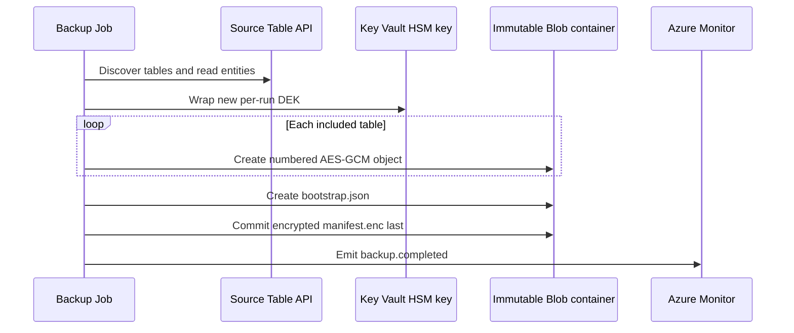
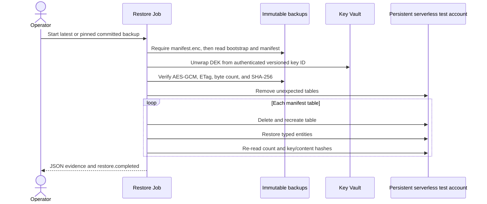

# Backup and restore runbooks

These runbooks operate the deployed platform described in [Deployment and CI/CD](deployment.md). They do not define the backup wire format or cryptography; [Backup format v1](backup-format.md) is authoritative. Apply the [security invariants](security.md) throughout.

## Operating model and gates

Both Azure Container Apps Jobs exist after the first infrastructure deployment. Their mode is controlled by Bicep:

| Operation | `scheduleEnabled` | `restoreAccessEnabled` | `restoreScheduleEnabled` | Effective job mode |
|---|---:|---:|---:|---|
| On-demand backup before acceptance | `false` | `false` | `false` | Backup is manual; restore is manual but has no conditional backup/key/target access |
| Daily backup | `true` | `false` | `false` | Backup uses the configured UTC cron (nonprod default `0 2 * * *`) |
| On-demand restore acceptance | either | `true` | `false` | Restore stays manual and receives conditional access |
| Monthly restore validation | either | `true` | `true` | Restore uses UTC cron (default `0 4 1 * *`) |

The schedules are disabled by default. Manual restore requires `restoreAccessEnabled=true`; `restoreScheduleEnabled` can and should remain false during acceptance. Monthly restore requires both values true. The `deploy-backup.yml` input `enable_restore_validation` sets both together, so it is only for post-acceptance monthly mode—not the initial manual test.

Set these shell variables for the examples:

```bash
export AZURE_BACKUP_SUBSCRIPTION_ID='<backup-subscription-id>'
export AZURE_RESOURCE_GROUP='<backup-resource-group>'
export AZURE_LOCATION='<azure-region>'
export SOURCE_COSMOS_ACCOUNT_RESOURCE_ID='<full-source-account-resource-id>'
export BACKUP_JOB_NAME='<prefix>-daily-backup'
export RESTORE_JOB_NAME='<prefix>-monthly-restore-test'
export IMAGE='<registry>.azurecr.io/cosmos-table-backup@sha256:<digest>'
```

## Backup runbook

### Run an on-demand backup

1. Confirm [source integration](deployment.md#deploy-source-integrationyml--deploy-source-integration) is applied, private DNS resolves the source Table endpoint from the workload network, the job uses the approved digest, and no previous execution is still running.
2. Start the job. A manual start is allowed whether its configured trigger is Manual or Schedule:

   ```bash
   az containerapp job start \
     --subscription "$AZURE_BACKUP_SUBSCRIPTION_ID" \
     --resource-group "$AZURE_RESOURCE_GROUP" \
     --name "$BACKUP_JOB_NAME"
   ```

3. Track execution state:

   ```bash
   az containerapp job execution list \
     --subscription "$AZURE_BACKUP_SUBSCRIPTION_ID" \
     --resource-group "$AZURE_RESOURCE_GROUP" \
     --name "$BACKUP_JOB_NAME" \
     --output table
   ```

4. In workspace-backed Application Insights/Log Analytics, correlate by backup ID and confirm one `backup.completed` event. Completion is emitted only after `manifest.enc` commits. Never infer success from a successful table upload, container exit alone, or a partial `backups/<uuid>/` prefix.

The run discovers tables afresh, excludes exact case-sensitive `cards` before opening its table client, and fails if discovery fails or no included table remains. It streams a logical per-table scan; tables are not captured at one cross-table point in time.



### Accept backup before enabling the schedule

Complete and record this gate in nonproduction:

1. Inspect the guarded deployment what-if; do not relax private networking or RBAC.
2. Verify private DNS from the Container Apps environment.
3. Complete one bounded manual backup and prove that `cards` is absent.
4. Confirm the committed manifest and encrypted objects follow [Backup format v1](backup-format.md).
5. Observe two consecutive scheduled backups after a reviewed temporary schedule enablement, or otherwise exercise the intended schedule under the change procedure.
6. Cause one controlled, reversible failure and verify the `backup.failed` alert; restore the valid configuration immediately.
7. Verify the 26-hour `backup.completed` dead-man alert behavior.
8. Review source request units, latency, and throttling during export.
9. Run the [required negative tests](security.md#required-negative-tests).
10. Validate version-level immutability and lifecycle behavior before the separate irreversible decision to lock the policy.

After acceptance, dispatch **Deploy backup platform** with `enable_schedule=true`, `enable_restore_validation=false`, and `apply=false`. Review `backup-what-if-*`, then repeat with `apply=true`. Do not enable a schedule while the placeholder image is present.

### Monitor backup

The platform creates these always-enabled scheduled-query alerts:

- **backup failure:** severity 1, evaluated every 5 minutes over 10 minutes, when `backup.failed` appears;
- **backup dead-man:** severity 0, evaluated hourly, when no `backup.completed` appears for 26 hours (query override range 48 hours).

The action group uses configured `alertEmails`; the nonproduction default is empty, so alerts exist without email recipients. Validate alert queries against actual `AppTraces` ingestion before enabling the schedule. Application telemetry is allowlisted: event, run ID, numeric table index/count, numeric measurements, status, and sanitized exception type. Table names, object paths, entity keys/values, plaintext/wrapped keys, access tokens, SAS tokens, and connection strings are not telemetry fields. Do not enable unsanitized Azure SDK HTTP logging.

### Interpret stage-level backup telemetry

`table_completed` adds one numeric summary per successful table; `backup.completed` adds the aggregate only after the create-only manifest commit. Existing entity/byte counters and event names remain unchanged. `backup.failed` includes elapsed time and sanitized exception type, not an exception message or partial success summary. A completed table does not imply a completed backup.

The logger accepts only built-in integers and finite built-in floats for measurement fields, including existing table/entity/byte counts and duration. It silently drops structured values, strings, booleans, numeric subclasses and non-finite floats before JSON serialization; invalid measurements do not interrupt the backup.

All durations are monotonic elapsed milliseconds, not CPU time. Rates use bytes/second (not MiB/second), and zero duration produces zero rates. Counters/totals and maxima use a fixed number of numeric accumulators; no per-entity, per-page, per-block history or percentile sample is retained.

| Fields | Meaning and boundaries |
|---|---|
| `duration_ms`, `entities_per_second` | Table processing including cleanup, or the entire run including discovery, key wrapping and metadata commits. |
| `entity_count`, `byte_count`, `plaintext_byte_count` | Table entity count, encrypted table-object bytes (including 33-byte framing), and encoded entity bytes. Run totals sum table payloads only, excluding bootstrap/manifest bytes. |
| `plaintext_bytes_per_second`, `encrypted_bytes_per_second` | Respective table payload totals divided by the table/run duration. |
| `page_count`, `page_fetch_ms`, `page_fetch_max_ms` | Successful logical SDK page advances (including empty pages), summed advance time, and maximum advance time. The terminal iterator probe contributes time but no count. |
| `stage_block_count`, `stage_block_bytes`, `stage_block_ms`, `stage_block_max_ms` | Successful staged-block count/bytes, summed SDK staging time, and maximum staging time. Run totals include bootstrap/manifest staging as well as table data. |
| `blob_commit_ms` | Summed create-only SDK commit time; run totals include metadata commits. |
| `digest_spill_count`, `digest_spill_bytes`, `digest_spill_ms` | Combined successful spill count/bytes for both digest streams; sorting and spill file-write elapsed time. |
| `digest_merge_ms`, `digest_merge_write_bytes` | Combined final digest calculation time (including in-memory sorting, final spill, consolidation and read/hash); bytes written by intermediate consolidation, not final hashing. Final spill time is nested inside final calculation time: do not sum them as disjoint stages. |
| `digest_scratch_peak_bytes_bound` | Conservative logical-file byte bound: twice combined spill bytes, permitting simultaneous merge input/output. Not a sampled filesystem peak or allocated disk usage. Run value is the maximum table bound because tables are sequential. |
| `local_processing_ms` | Table elapsed time minus page advance, stage and commit time, clamped to zero. Includes serialization, hashes, AES-GCM, digest/scratch I/O, setup, cleanup and instrumentation. Digest timers are subsets of this residual; do not add them again. Run value sums table residuals, excluding run setup/metadata work. |

The pinned Table SDK materializes and converts the returned page before `next(pages)` returns. Consequently page time includes network/retry/backoff, response decoding and SDK entity conversion, but excludes our consumer serialization/encryption work. It is **not pure Cosmos service time**. Staging/commit time likewise includes SDK overhead and retries. These counters are logical operations, **not physical HTTP attempts**, and do not claim retry count, per-request RU charge, or throttling status. Timer contexts close even when an operation raises; failures still propagate and do not emit a success summary.

Use page time as a source-read indicator, staging/commit time as a Blob-write indicator, and the local residual plus digest timings as a CPU/local-I/O indicator. Separate CPU utilization and disk measurements are needed to split CPU from local I/O. Compare stage proportions and external service metrics rather than attributing every millisecond to a server.

### Measure performance in nonproduction

This procedure uses the existing jobs and pinned SDK, not a benchmark harness. **Commands below are for a separately approved experiment, not authorization to execute Azure operations.** Provisioning, identity grants, job configuration and cleanup need operator approval. The historical resources below were removed; their endpoints/jobs cannot be reused.

1. Prepare a dedicated, empty **nonproduction Cosmos DB for Table source**, a different disposable restore account, and manual backup/restore jobs following [deployment prerequisites](deployment.md#prerequisites) and the runbooks above. Confirm both jobs use the approved immutable image, source/target IDs differ, private DNS works, public/local-key access stays disabled, and schedules are off. Use separate seed (synthetic source write), backup (source read only) and restore identities. Run the seed snippet on an approved private managed-identity host with Python 3.14 and the frozen dependencies from [CONTRIBUTING](../CONTRIBUTING.md#development-and-validation); do not use a production job or identity. Record approved resource IDs privately, the commit/image, SDK versions, source capacity, page/block sizes and job CPU/memory/time limits. Enforce approved seed-host wall-time and job scratch limits before starting; stop if the budget is exhausted. Keep all evidence outside Git.

2. Initialize two empty synthetic tables through the operator's approved ARM identity. Set the source variables explicitly; neither command belongs on a production account. [Azure CLI Table commands](https://learn.microsoft.com/en-us/cli/azure/cosmosdb/table) support this initialization without account keys:

   ```bash
   export SYNTHETIC_SUBSCRIPTION_ID='<approved-test-subscription>'
   export SYNTHETIC_RESOURCE_GROUP='<dedicated-source-rg>'
   export SYNTHETIC_ACCOUNT='<dedicated-source-account>'
   export SOURCE_COSMOS_ACCOUNT_RESOURCE_ID="/subscriptions/$SYNTHETIC_SUBSCRIPTION_ID/resourceGroups/$SYNTHETIC_RESOURCE_GROUP/providers/Microsoft.DocumentDB/databaseAccounts/$SYNTHETIC_ACCOUNT"
   az cosmosdb table create --subscription "$SYNTHETIC_SUBSCRIPTION_ID" \
     --resource-group "$SYNTHETIC_RESOURCE_GROUP" --account-name "$SYNTHETIC_ACCOUNT" --name synthetic --output none
   az cosmosdb table create --subscription "$SYNTHETIC_SUBSCRIPTION_ID" \
     --resource-group "$SYNTHETIC_RESOURCE_GROUP" --account-name "$SYNTHETIC_ACCOUNT" --name cards --output none
   ```

   Choose provisioned capacity under the approval if applicable; do not pass provisioned throughput to a serverless account. Table-native RBAC feasibility is a real-service gate, not guaranteed by the role name. Empty-account enumeration previously returned 403 until ARM initialization; stop on any authorization failure rather than adding SQL grants or relaxing networking.

3. On the seed host, set `SYNTHETIC_ACCOUNT` to that same approved account and `SEED_CLIENT_ID` to the seed managed identity. Populate 70,000 entities evenly across 16 partitions (4,375 each), with one fixed 256-byte ASCII payload, plus one excluded `cards` canary. This bounded sequential snippet keeps one entity in flight, requires empty tables, never prints keys/values and fails rather than upserting existing data. The [Table SDK](https://learn.microsoft.com/en-us/python/api/azure-data-tables/azure.data.tables.tableclient) supports `create_entity` and paged `list_entities`; the [service client](https://learn.microsoft.com/en-us/python/api/azure-data-tables/azure.data.tables.tableserviceclient) supports the explicit Cosmos audience.

   ```bash
   uv run --frozen --no-sync --no-build python - <<'PY'
   import os
   from azure.data.tables import TableServiceClient
   from azure.identity import ManagedIdentityCredential

   endpoint = f"https://{os.environ['SYNTHETIC_ACCOUNT']}.table.cosmos.azure.com"
   with ManagedIdentityCredential(client_id=os.environ["SEED_CLIENT_ID"]) as credential:
       with TableServiceClient(endpoint, credential=credential,
                               audience="https://cosmos.azure.com") as service:
           if {t.name for t in service.list_tables()} != {"synthetic", "cards"}:
               raise RuntimeError("Expected only the two dedicated synthetic tables")
           data = service.get_table_client("synthetic")
           canary = service.get_table_client("cards")
           for table in (data, canary):
               if next(iter(table.list_entities(results_per_page=1)), None) is not None:
                   raise RuntimeError("Synthetic tables must be empty")
           for i in range(70_000):
               data.create_entity({"PartitionKey": f"p{i % 16:02d}",
                                   "RowKey": f"r{i:08d}", "payload": "x" * 256})
           canary.create_entity({"PartitionKey": "synthetic", "RowKey": "canary"})
           if (sum(1 for _ in data.list_entities(results_per_page=500)) != 70_000
                   or sum(1 for _ in canary.list_entities(results_per_page=500)) != 1):
               raise RuntimeError("Synthetic entity counts did not match")
   print("Synthetic counts verified: 70000 included, 1 excluded")
   PY
   ```

   On failure, treat the workload as partial; clean/reinitialize under approval before retrying. Do not seed during measurement. Configure the dedicated backup job to this source with `synthetic` included, preserving configured exclusions and mandatory `cards`; use `BACKUP_PAGE_SIZE=500`, `BACKUP_BLOCK_SIZE=4194304` for the reference workload. The 256 bytes describe only the payload, not encoded entity size.

4. Run three sequential backups via [Run an on-demand backup](#run-an-on-demand-backup), recording UTC start/end and execution name for each. Wait for terminal execution state and telemetry ingestion before the next run; no concurrent traffic or setting changes. In Log Analytics **Logs**, substitute the UTC window and run UUID in this KQL to collect allowlisted stage summaries (not raw container/SDK logs):

   ```kusto
   AppTraces
   | where TimeGenerated between (datetime(<UTC-start>) .. datetime(<UTC-end>))
   | extend m = parse_json(Message)
   | where tostring(m.backup_id) == "<backup-uuid>"
   | where tostring(m.event) in ("table_completed", "backup.completed", "backup.failed")
   | project TimeGenerated, event=tostring(m.event), backup_id=tostring(m.backup_id),
       table_index=toint(m.table_index), table_count=toint(m.table_count),
       entities=tolong(m.entity_count), elapsed_ms=todouble(m.duration_ms),
       entities_per_second=todouble(m.entities_per_second),
       plaintext_bytes_per_second=todouble(m.plaintext_bytes_per_second),
       encrypted_bytes_per_second=todouble(m.encrypted_bytes_per_second),
       pages=tolong(m.page_count), page_ms=todouble(m.page_fetch_ms),
       blocks=tolong(m.stage_block_count), stage_ms=todouble(m.stage_block_ms),
       commit_ms=todouble(m.blob_commit_ms), local_ms=todouble(m.local_processing_ms),
       spill_bytes=tolong(m.digest_spill_bytes), spill_ms=todouble(m.digest_spill_ms),
       merge_ms=todouble(m.digest_merge_ms), scratch_bound=tolong(m.digest_scratch_peak_bytes_bound)
   ```

   Require one `backup.completed`, one included table and 70,000 entities; missing completion is failure, not a usable baseline. Compare per-table `page_ms`, `stage_ms + commit_ms` and `local_ms` against `elapsed_ms`, then medians/ranges across runs; do not double-count digest timers. Record CPU/memory observations from the job's Azure Monitor metrics if available at the execution grain; label missing CPU/RSS/disk measurements unavailable. The scratch field is a bound, not an observed peak. No instrumentation-disable switch remains, so this procedure does not reproduce the historical overhead comparison.

5. Query the **actual synthetic Table account's** metric definitions, then values over each recorded window. [Metric definitions](https://learn.microsoft.com/en-us/azure/azure-monitor/reference/supported-metrics/microsoft-documentdb-databaseaccounts-metrics) describe resource-wide availability; live Table applicability and populated buckets still need verification. [CLI metric queries](https://learn.microsoft.com/en-us/cli/azure/monitor/metrics) use the supported name, aggregation, dimensions and grain:

   ```bash
   az monitor metrics list-definitions --resource "$SOURCE_COSMOS_ACCOUNT_RESOURCE_ID" --output json
   export START_UTC='<UTC-start-in-ISO-8601>' END_UTC='<UTC-end-in-ISO-8601>'
   export METRIC='NormalizedRUConsumption' AGGREGATION='Maximum' GRAIN='PT1M'
   az monitor metrics list --resource "$SOURCE_COSMOS_ACCOUNT_RESOURCE_ID" \
     --metrics "$METRIC" --aggregation "$AGGREGATION" --interval "$GRAIN" \
     --start-time "$START_UTC" --end-time "$END_UTC" --output json
   ```

   Repeat with `ThrottledRequestPercentage`/`Average`, `TotalRequests`/`Count`, and `ServerSideLatencyGateway`/`Average` only where supported. Split request series with `--dimension StatusCode OperationType` only if those dimensions exist, checking actual returned Table operation/status values rather than assuming GET/200. Preserve units, filters, dimensions and missing buckets; requery after ingestion delay. Correlation is temporal, not a backup-ID/request join; exclude seeding/restore windows and disclose other traffic. Logical pages are not physical attempts. `TotalRequestUnits` is documented as SQL RU consumption, not evidence of Table per-request charges. Missing buckets are not zeros, and observing zero throttling is not an induced-429 test.

6. Pin each committed UUID with the existing [on-demand isolated restore command](#run-an-on-demand-restore-validation), using already approved restore-only access and keeping its schedule off. Require a successful deterministic report and matching `restore.completed`, exact table set (`synthetic`, no `cards`), 70,000 entities, and manifest/target key and content hashes as described in [What a successful restore proves](#what-a-successful-restore-proves). A 403 on enumeration or delete/recreate leaves integrity **unverified**; stop and record the sanitized error type/stage, not success. The historical delete 403 remains unresolved even with Table-native contributor access; no permission workaround or bypass is part of this procedure.

7. After executions stop and safe aggregate evidence is retained, use [restored-data/access cleanup](#clean-up-restored-data-and-close-access) and [teardown](#teardown) under separate operator approval. For approved ARM cleanup of these test tables, run `az cosmosdb table delete` with the same explicit subscription/resource-group/account arguments from step 2, `--name synthetic --yes`, then `--name cards --yes`; on the **different restore account**, delete only its synthetic table. Verify each account with `az cosmosdb table list` and the same explicit account arguments. Remove only dedicated test resources/grants/endpoints/DNS/deployment records, preserving shared infrastructure. Retain encrypted blobs until approved lifecycle/WORM eligibility; verify physical deletion from an authorized private host later, or record it unverified. Never grant Blob delete to the backup identity, weaken network rules or bypass retention to clean up.

### Historical synthetic baseline (2026-09-30)

Six approved Azure backups used 70,000 entities, 16 partitions, 256-byte payloads, 500-entity pages, 4 MiB blocks and 1 CPU / 2 GiB per job. The independently counted `cards` canary was excluded. Table source capacity was 4,000 RU/s plus 400 RU/s for `cards`; Python 3.14 and pinned dependencies were used. Image digest: `sha256:f8da4bf43a5bde9adc1f887b237792b8960ef118b4ae094690dfa0bcc64526e3`.

| Measurement | Result |
|---|---|
| Median enabled / disabled wall time | 12.774 / 12.291 s; 3.93% difference across three pairs, not an established overhead bound |
| Source paging / local residual / Blob writes | 61.7–64.9% / 24.3–26.2% / 8.9–14.0% of table elapsed |
| Process RSS high-water | 100,110,336–102,277,120 bytes; includes native allocations |
| Digest spill bytes / logical scratch bound | 4,480,000 / 8,960,000 bytes; bound is not measured disk usage or a quota |
| Azure Monitor, UTC 12:52–12:58, PT1M | Normalized RU maxima 15–23%; average throttling 0%; no induced 429 test |
| Table GET/200 requests / gateway latency | 140 requests and 26.079 / 26.350 ms in only two minute buckets; other buckets incomplete |

Source paging dominated this workload, but includes SDK conversion/retries, not just server time. Exact Table per-backup RU charges and complete throttling correlation were not established. The earlier offline discard-sink comparison measured −1.71% median variation and a 13,632,916-byte traced allocation peak; these are not Azure throughput or guaranteed overhead bounds.

**Restore gate remains unresolved:** the isolated restore failed with HTTP 403 at `TableServiceClient.delete_table` despite Table-native contributor access. Initial enumeration also failed until an operator initialized an empty table through ARM. No successful count/key/content/table-set verification was produced. Do not infer that SQL grants are appropriate, bypass delete/recreate or enable scheduled validation.

Dedicated Azure test resources, identity grants, images, DNS and deployment records were removed and verified; shared infrastructure remained present. Encrypted synthetic backups remain under the existing 14-day Blob lifecycle policy because operator access was network-blocked; physical deletion is unverified. One-off benchmark scripts and harnesses were removed to avoid maintenance overhead; detailed experiment evidence remains in [issue #25](https://github.com/smereczynski/CosmosDB-Table-Backup/issues/25), and the offline script is available in Git history at merged PR #39.

### Triage a failed backup

| Symptom | Action |
|---|---|
| No `manifest.enc` | Treat the run as failed. Preserve partial blobs for investigation; lifecycle management handles them later. Never restore the prefix. |
| Cosmos 401/403 | Check the source Table data-plane reader assignment and managed-identity audience. Do not enable keys. |
| Name resolution/connectivity | Check private endpoint approval, private DNS links, NSG/platform dependencies, and the source endpoint. Do not enable public access as a workaround. |
| Cosmos 429 | Reduce configured page size/concurrency or move the schedule; stay inside the accepted RU budget. |
| Key wrap failure | Confirm the exact versioned HSM key is enabled and the backup identity has metadata/wrap only. |
| Blob conflict | Use a new run ID. Never overwrite an immutable object. |

## Restore-validation runbook

### Understand the target before enabling access

The dedicated restore account is provisioned **unconditionally** with the platform and persists between tests. It is a private, local-auth-disabled Cosmos DB for Table account in serverless capacity mode, with no fixed provisioned RU/s. Its resource ID must differ from the source, and the runtime repeats that identity/endpoint check before any data-plane operation.

A restore execution never creates the account. It deletes unexpected user tables, then deletes and recreates each manifest table. After success, restored data remains in the persistent test account until an operator cleans it up, runs another validation that recreates it, or tears down the account. It is not a production restore destination.

### Run an on-demand restore validation

1. Choose a successfully committed backup. If no UUID is supplied, the restore selects the `manifest.enc` with the newest Blob `last_modified` value. To test a specific committed backup, retain its UUID for step 4.
2. Enable access **without** enabling the schedule. Because the current workflow couples the flags, perform the same reviewed subscription deployment locally (or through an equivalently protected approved pipeline):

   ```bash
   export BACKUP_SCHEDULE_ENABLED='true' # use false if daily backup is not yet accepted
   export ALLOW_ROLE_ASSIGNMENT_CHANGES=1
   az deployment sub what-if \
     --subscription "$AZURE_BACKUP_SUBSCRIPTION_ID" \
     --location "$AZURE_LOCATION" \
     --template-file infra/main.bicep \
     --parameters infra/parameters/nonprod.bicepparam \
     --parameters sourceCosmosAccountResourceId="$SOURCE_COSMOS_ACCOUNT_RESOURCE_ID" \
                  backupImage="$IMAGE" \
                  scheduleEnabled="$BACKUP_SCHEDULE_ENABLED" \
                  restoreAccessEnabled=true \
                  restoreScheduleEnabled=false \
     --result-format FullResourcePayloads --output json > what-if.json
   python3 scripts/guard-what-if.py
   ```

   Review `what-if.json` under the same change-control standard as the protected environment, then replace `what-if` with `create` (and omit `--result-format FullResourcePayloads`) using identical parameters. This creates the four conditional grants: Blob read, key metadata/unwrap, telemetry publishing, and target Cosmos data contribution.
3. Start the latest committed backup test:

   ```bash
   az containerapp job start \
     --subscription "$AZURE_BACKUP_SUBSCRIPTION_ID" \
     --resource-group "$AZURE_RESOURCE_GROUP" \
     --name "$RESTORE_JOB_NAME"
   ```

   Or pin a committed UUID for this execution:

   ```bash
   export BACKUP_ID='<committed-backup-uuid>'
   az containerapp job start \
     --subscription "$AZURE_BACKUP_SUBSCRIPTION_ID" \
     --resource-group "$AZURE_RESOURCE_GROUP" \
     --name "$RESTORE_JOB_NAME" \
     --container-name restore-validation \
     --env-vars RESTORE_BACKUP_ID="$BACKUP_ID"
   ```

4. Monitor the execution list as for backup, substituting `RESTORE_JOB_NAME`. Inspect the container output for the JSON verification report and query `AppTraces` for exactly one matching `restore.completed`. A missing or nonzero execution, `restore.failed`, or absent report is a failed validation.



### What a successful restore proves

Before writing a table, the job authenticates the bootstrap-bound encrypted manifest, validates its schema/object paths, unwraps the DEK with RSA-OAEP-256, and reads the immutable table object conditionally against one ETag. It verifies encrypted size/SHA-256 and plaintext SHA-256. It then recreates the table, restores typed records, repeats source-object verification, and re-enumerates the target.

Success requires exact table-set equality and, for every table, equality of manifest entity count, order-independent entity-key hash, and persisted-content hash. The JSON report includes backup ID, target endpoint, table/entity counts, per-table encrypted/plaintext/key/content hashes, and an overall deterministic report hash; it includes no entity values. See [Restore protocol](backup-format.md#restore-protocol) for the authoritative algorithm and failure semantics.

### Accept restore before enabling monthly validation

1. Complete a manual test with `restoreAccessEnabled=true` and `restoreScheduleEnabled=false`.
2. Confirm isolated source/target IDs, private DNS, keyless access, selected backup UUID, exact table set, counts/hashes, JSON report, and `restore.completed`.
3. Exercise a controlled failed validation and confirm `restore.failed` alerting.
4. Review data retention and operator cleanup evidence.
5. Close the temporary access window and verify the four conditional grants are gone as described below.
6. Obtain security/operations approval for continuously active restore-only grants.
7. Dispatch **Deploy backup platform** with `enable_restore_validation=true` and the accepted backup schedule setting, first `apply=false` and then `apply=true` after reviewing the artifact. This enables both restore access and the monthly trigger.

The restore failure alert is always present (severity 1, every 5 minutes over 10 minutes). The 35-day restore success dead-man alert is severity 0, evaluated daily, and exists only while both access and schedule are enabled.

### Clean up restored data and close access

Cleanup is operator-owned. The next restore removes unexpected tables and recreates expected tables, but it does not empty the persistent account after evidence collection. While an approved data-plane identity is available, remove the test tables according to organizational procedure and verify that no user tables remain. Do not grant keys or public access to simplify cleanup.

Redeploy with `restoreAccessEnabled=false` and `restoreScheduleEnabled=false`. **That incremental ARM deployment does not remove conditional role assignments created by an earlier deployment.** Explicitly remove and verify these assignments for the restore identity:

1. Storage Blob Data Reader on the backup container;
2. the custom `<prefix> Key metadata and unwrap only` assignment on the Key Vault key;
3. Monitoring Metrics Publisher on Application Insights; and
4. Cosmos DB built-in data contributor on the restore-test account.

Use assignment IDs from Azure rather than broad name-based deletion, preserve the always-present ACR pull needed to start the dormant job, and record effective-access verification. An Azure Deployment Stack configured to delete resources that become unmanaged is the alternative documented in the [infrastructure reference](../infra/README.md#deployment-order).

### Respond to a failed restore

- Guard/configuration errors exit with code 2; data/authentication/write failures exit nonzero and emit `restore.failed`.
- A missing committed marker, malformed metadata, wrong key version, nonce/AAD/tag/hash/count mismatch, changed Blob ETag, oversized record, or target write failure must never be overridden.
- A failure can leave a partially populated recreated table. After correcting the cause, rerun the complete restore; it deletes/recreates that table and repeats every check.
- Never reinterpret isolated validation as permission or a procedure to write to the production source.

## Teardown

1. Disable both schedules and restore access through reviewed deployment.
2. Wait for all Container Apps Job executions to finish.
3. Remove the four conditional restore assignments explicitly and verify the source-side reader/private-endpoint integration is removed under source-subscription change control.
4. Clean test data. To remove only the restore account, delete it under operator approval; because it is an unconditional Bicep resource, any later full platform deployment recreates it.
5. Before deleting the platform/resource group, account for immutable backup retention, soft delete/purge protection, source integration, DNS/private endpoints, alerting, and evidence-retention requirements. Do not attempt to bypass locked WORM retention.

Return to [Deployment and CI/CD](deployment.md) for promotion/rollback and production fork procedures, or [Security invariants](security.md) for negative tests and release blockers.
