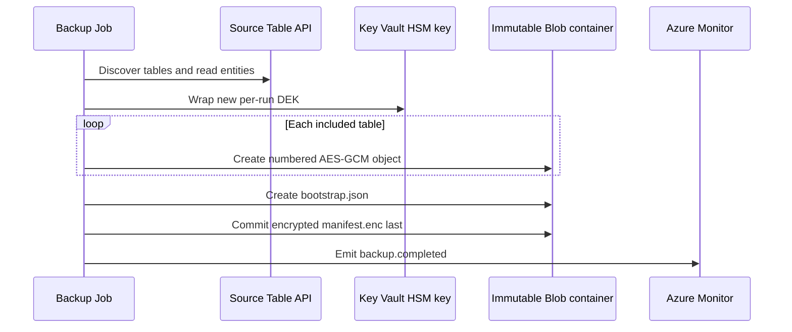

# Backup and restore runbooks

These runbooks operate the deployed platform described in [Deployment and CI/CD](deployment.md). They do not define the backup wire format or cryptography; [Backup format v1](backup-format.md) is authoritative. Apply the [security invariants](security.md) throughout.

## Operating model and gates

Both Azure Container Apps Jobs exist after the first infrastructure deployment. Their mode is controlled by Bicep:

| Operation | `scheduleEnabled` | `restoreAccessEnabled` | `restoreScheduleEnabled` | Effective job mode |
|---|---:|---:|---:|---|
| On-demand backup before acceptance | `false` | `false` | `false` | Backup is manual; restore is manual but has no conditional backup/key/target access |
| Daily backup | `true` | `false` | `false` | Backup uses the configured UTC cron (nonprod default `0 2 * * *`) |
| On-demand restore acceptance | either | `true` | `false` | Restore stays manual and receives conditional access |
| Monthly restore validation | either | `true` | `true` | Restore uses UTC cron (default `0 4 1 * *`) |

The schedules are disabled by default. Manual restore requires `restoreAccessEnabled=true`; `restoreScheduleEnabled` can and should remain false during acceptance. Monthly restore requires both values true. Use `deploy-backup.yml` with `enable_restore_access=true` and `enable_restore_validation=false` for manual acceptance. The legacy `enable_restore_validation=true` still enables both access and monthly scheduling, regardless of the access-only input; use it only after acceptance.

Set these shell variables for the examples:

```bash
export AZURE_BACKUP_SUBSCRIPTION_ID='<backup-subscription-id>'
export AZURE_RESOURCE_GROUP='<backup-resource-group>'
export AZURE_LOCATION='<azure-region>'
export SOURCE_COSMOS_ACCOUNT_RESOURCE_ID='<full-source-account-resource-id>'
export BACKUP_JOB_NAME='<prefix>-daily-backup'
export RESTORE_JOB_NAME='<prefix>-monthly-restore-test'
export IMAGE='<registry>.azurecr.io/cosmos-table-backup@sha256:<digest>'
```

## Backup runbook

### Run an on-demand backup

1. Confirm [source integration](deployment.md#deploy-source-integrationyml--deploy-source-integration) is applied, private DNS resolves the source Table endpoint from the workload network, the job uses the approved digest, and no previous execution is still running.
2. Start the job. A manual start is allowed whether its configured trigger is Manual or Schedule:

   ```bash
   az containerapp job start \
     --subscription "$AZURE_BACKUP_SUBSCRIPTION_ID" \
     --resource-group "$AZURE_RESOURCE_GROUP" \
     --name "$BACKUP_JOB_NAME"
   ```

3. Track execution state:

   ```bash
   az containerapp job execution list \
     --subscription "$AZURE_BACKUP_SUBSCRIPTION_ID" \
     --resource-group "$AZURE_RESOURCE_GROUP" \
     --name "$BACKUP_JOB_NAME" \
     --output table
   ```

4. In workspace-backed Application Insights/Log Analytics, correlate by backup ID and confirm one `backup.completed` event. Completion is emitted only after `manifest.enc` commits. Never infer success from a successful table upload, container exit alone, or a partial `backups/<uuid>/` prefix.

The run discovers tables afresh, excludes exact case-sensitive `cards` before opening its table client, and fails if discovery fails or no included table remains. It streams a logical per-table scan; tables are not captured at one cross-table point in time.



### Accept backup before enabling the schedule

Complete and record this gate in nonproduction:

1. Inspect the guarded deployment what-if; do not relax private networking or RBAC.
2. Verify private DNS from the Container Apps environment.
3. Complete one bounded manual backup and prove that `cards` is absent.
4. Confirm the committed manifest and encrypted objects follow [Backup format v1](backup-format.md).
5. Observe two consecutive scheduled backups after a reviewed temporary schedule enablement, or otherwise exercise the intended schedule under the change procedure.
6. Cause one controlled, reversible failure and verify the `backup.failed` alert; restore the valid configuration immediately.
7. Verify the 26-hour `backup.completed` dead-man alert behavior.
8. Review source request units, latency, and throttling during export.
9. Run the [required negative tests](security.md#required-negative-tests).
10. Validate version-level immutability and lifecycle behavior before the separate irreversible decision to lock the policy.

After acceptance, dispatch **Deploy backup platform** with `enable_schedule=true`, `enable_restore_validation=false`, and `apply=false`. Review `backup-what-if-*`, then repeat with `apply=true`. Do not enable a schedule while the placeholder image is present.

### Monitor backup

The platform creates these always-enabled scheduled-query alerts:

- **backup failure:** severity 1, evaluated every 5 minutes over 10 minutes, when `backup.failed` appears;
- **backup dead-man:** severity 0, evaluated hourly, when no `backup.completed` appears for 26 hours (query override range 48 hours).

The action group uses configured `alertEmails`; the nonproduction default is empty, so alerts exist without email recipients. Validate alert queries against actual `AppTraces` ingestion before enabling the schedule. Application telemetry is allowlisted: event, run ID, numeric table index/count, numeric measurements, status, and sanitized exception type. Table names, object paths, entity keys/values, plaintext/wrapped keys, access tokens, SAS tokens, and connection strings are not telemetry fields. Do not enable unsanitized Azure SDK HTTP logging.

### Interpret stage-level backup telemetry

`table_completed` adds one numeric summary per successful table; `backup.completed` adds the aggregate only after the create-only manifest commit. Existing entity/byte counters and event names remain unchanged. `backup.failed` includes elapsed time and sanitized exception type, not an exception message or partial success summary. A completed table does not imply a completed backup.

The logger accepts only built-in integers and finite built-in floats for measurement fields, including existing table/entity/byte counts and duration. It silently drops structured values, strings, booleans, numeric subclasses and non-finite floats before JSON serialization; invalid measurements do not interrupt the backup.

All durations are monotonic elapsed milliseconds, not CPU time. Rates use bytes/second (not MiB/second), and zero duration produces zero rates. Counters/totals and maxima use a fixed number of numeric accumulators; no per-entity, per-page, per-block history or percentile sample is retained.

| Fields | Meaning and boundaries |
|---|---|
| `duration_ms`, `entities_per_second` | Table processing including cleanup, or the entire run including discovery, key wrapping and metadata commits. |
| `entity_count`, `byte_count`, `plaintext_byte_count` | Table entity count, encrypted table-object bytes (including 33-byte framing), and encoded entity bytes. Run totals sum table payloads only, excluding bootstrap/manifest bytes. |
| `plaintext_bytes_per_second`, `encrypted_bytes_per_second` | Respective table payload totals divided by the table/run duration. |
| `page_count`, `page_fetch_ms`, `page_fetch_max_ms` | Successful logical SDK page advances (including empty pages), summed advance time, and maximum advance time. The terminal iterator probe contributes time but no count. |
| `stage_block_count`, `stage_block_bytes`, `stage_block_ms`, `stage_block_max_ms` | Successful staged-block count/bytes, summed SDK staging time, and maximum staging time. Run totals include bootstrap/manifest staging as well as table data. |
| `blob_commit_ms` | Summed create-only SDK commit time; run totals include metadata commits. |
| `digest_spill_count`, `digest_spill_bytes`, `digest_spill_ms` | Combined successful spill count/bytes for both digest streams; sorting and spill file-write elapsed time. |
| `digest_merge_ms`, `digest_merge_write_bytes` | Combined final digest calculation time (including in-memory sorting, final spill, consolidation and read/hash); bytes written by intermediate consolidation, not final hashing. Final spill time is nested inside final calculation time: do not sum them as disjoint stages. |
| `digest_scratch_peak_bytes_bound` | Conservative logical-file byte bound: twice combined spill bytes, permitting simultaneous merge input/output. Not a sampled filesystem peak or allocated disk usage. Run value is the maximum table bound because tables are sequential. |
| `local_processing_ms` | Table elapsed time minus page advance, stage and commit time, clamped to zero. Includes serialization, hashes, AES-GCM, digest/scratch I/O, setup, cleanup and instrumentation. Digest timers are subsets of this residual; do not add them again. Run value sums table residuals, excluding run setup/metadata work. |

The pinned Table SDK materializes and converts the returned page before `next(pages)` returns. Consequently page time includes network/retry/backoff, response decoding and SDK entity conversion, but excludes our consumer serialization/encryption work. It is **not pure Cosmos service time**. Staging/commit time likewise includes SDK overhead and retries. These counters are logical operations, **not physical HTTP attempts**, and do not claim retry count, per-request RU charge, or throttling status. Timer contexts close even when an operation raises; failures still propagate and do not emit a success summary.

Use page time as a source-read indicator, staging/commit time as a Blob-write indicator, and the local residual plus digest timings as a CPU/local-I/O indicator. Separate CPU utilization and disk measurements are needed to split CPU from local I/O. Compare stage proportions and external service metrics rather than attributing every millisecond to a server.

### Historical test results (2026-09-30)

These are results of completed synthetic tests, retained only as historical evidence. The experiment code, dedicated tests, infrastructure and execution procedures are not part of the project; no repeat of these experiments is currently planned. The results are workload-specific observations, not current performance guarantees or evidence of successful restore validation.

Six approved Azure backups used 70,000 entities, 16 partitions, 256-byte payloads, 500-entity pages, 4 MiB blocks and 1 CPU / 2 GiB per job. The independently counted `cards` canary was excluded. Table source capacity was 4,000 RU/s plus 400 RU/s for `cards`; Python 3.14 and pinned dependencies were used. Image digest: `sha256:f8da4bf43a5bde9adc1f887b237792b8960ef118b4ae094690dfa0bcc64526e3`.

| Measurement | Result |
|---|---|
| Median enabled / disabled wall time | 12.774 / 12.291 s; 3.93% difference across three pairs, not an established overhead bound |
| Source paging / local residual / Blob writes | 61.7–64.9% / 24.3–26.2% / 8.9–14.0% of table elapsed |
| Process RSS high-water | 100,110,336–102,277,120 bytes; includes native allocations |
| Digest spill bytes / logical scratch bound | 4,480,000 / 8,960,000 bytes; bound is not measured disk usage or a quota |
| Azure Monitor, UTC 12:52–12:58, PT1M | Normalized RU maxima 15–23%; average throttling 0%; no induced 429 test |
| Table GET/200 requests / gateway latency | 140 requests and 26.079 / 26.350 ms in only two minute buckets; other buckets incomplete |

Source paging dominated this workload, but includes SDK conversion/retries, not just server time. Exact Table per-backup RU charges and complete throttling correlation were not established. The earlier offline discard-sink comparison measured −1.71% median variation and a 13,632,916-byte traced allocation peak; these are not Azure throughput or guaranteed overhead bounds.

**Restore gate remains unresolved:** the isolated restore failed with HTTP 403 at `TableServiceClient.delete_table` despite Table-native contributor access. Initial enumeration also failed until an operator initialized an empty table through ARM. No successful count/key/content/table-set verification was produced. Do not infer that SQL grants are appropriate, bypass delete/recreate or enable scheduled validation.

Dedicated Azure test resources, identity grants, images, DNS and deployment records were removed and verified; shared infrastructure remained present. Encrypted synthetic backups remain under the existing 14-day Blob lifecycle policy because operator access was network-blocked; physical deletion is unverified. Detailed historical test evidence remains in [issue #25](https://github.com/smereczynski/CosmosDB-Table-Backup/issues/25).

### Triage a failed backup

| Symptom | Action |
|---|---|
| No `manifest.enc` | Treat the run as failed. Preserve partial blobs for investigation; lifecycle management handles them later. Never restore the prefix. |
| Cosmos 401/403 | Check the source Table data-plane reader assignment and managed-identity audience. Do not enable keys. |
| Name resolution/connectivity | Check private endpoint approval, private DNS links, NSG/platform dependencies, and the source endpoint. Do not enable public access as a workaround. |
| Cosmos 429 | Reduce configured page size/concurrency or move the schedule; stay inside the accepted RU budget. |
| Key wrap failure | Confirm the exact versioned HSM key is enabled and the backup identity has metadata/wrap only. |
| Blob conflict | Use a new run ID. Never overwrite an immutable object. |

## Restore-validation runbook

### Understand the target before enabling access

The dedicated restore account is provisioned **unconditionally** with the platform and persists between tests. It is a private, local-auth-disabled Cosmos DB for Table account in serverless capacity mode, with no fixed provisioned RU/s. Its resource ID must differ from the source, and the runtime repeats that identity/endpoint check before any data-plane operation.

The reviewed IaC also sets `disableKeyBasedMetadataWriteAccess=true`. Microsoft defines this property as disabling metadata writes [based on account keys](https://learn.microsoft.com/en-us/azure/templates/microsoft.documentdb/2025-04-15/databaseaccounts); it is distinct from [disabling local authentication](https://learn.microsoft.com/en-us/azure/cosmos-db/table/how-to-connect-role-based-access-control#disable-key-based-authentication). It does not grant Entra-authenticated Table lifecycle access or govern the independently authorized ARM lifecycle stage. Microsoft also documents the [management-plane/account-key distinction](https://learn.microsoft.com/en-us/azure/cosmos-db/resource-locks#manage-locks), with Table-specific lock examples; SQL API behavior is not evidence of Table lifecycle feasibility.

**Retired hypothesis:** [PR #48](https://github.com/smereczynski/CosmosDB-Table-Backup/pull/48) set this flag to false in an attempt to resolve the runtime Table lifecycle HTTP 403. The relaxation did not resolve the Entra-authenticated denial, as recorded in [issue #45](https://github.com/smereczynski/CosmosDB-Table-Backup/issues/45) and the [PR review](https://github.com/smereczynski/CosmosDB-Table-Backup/pull/48#discussion_r4146886889). Governed restore instead separates ARM table lifecycle from runtime entity operations. Restoring the flag retires that ineffective relaxation without claiming that legacy direct or monthly restore is repaired.

**Rollout gate remains open:** offline contracts and Bicep validation prove the intended configuration only. [Issue #53](https://github.com/smereczynski/CosmosDB-Table-Backup/issues/53) still requires a separately authorized nonproduction rollout, property readback, and successful governed restore with the flag enabled. Historical governed success with the relaxed flag does not satisfy that gate. This code change does not authorize deployment, grants, source writes, or monthly scheduling.

Neither restore mode creates the account. In governed mode, the protected operator identity deletes/recreates the isolated target tables through ARM and proves the exact prepared table set; runtime only restores and verifies entities. Legacy direct mode instead performs native Table list/delete/create operations, whose feasibility remains unproven on this target. After success, restored data remains in the persistent test account until an operator cleans it up, runs another governed validation that recreates it, or tears down the account. It is not a production restore destination.

### Run a governed on-demand backup and restore validation

Use **On-demand backup and isolated restore** (`run-on-demand.yml`) on `main` through the protected `backup-infrastructure` environment. Keep both jobs Manual and restore access enabled. Set environment variable `RESTORE_JOB_NAME` to the existing isolated restore job, alongside the existing deployment identity, subscription, resource group, source account, backup job, and registry settings.

Leave `backup_id` empty for a fresh backup followed by restore, or supply a committed UUID for restore-only testing. The workflow:

1. Validates matching immutable images, protected `cards` exclusion, source/target/store bindings, private networking and disabled local authentication.
2. Runs backup when requested, requiring both successful execution and its matching completion event.
3. Runs `restore-test --plan` inside the private managed-identity job. It authenticates bootstrap, manifest and every encrypted table object before emitting a bounded private framed plan. No target client is opened.
4. Rechecks idle jobs and unchanged configuration, then uses the protected operator identity to delete/recreate only the isolated target tables through ARM. Exact prepared table-set equality is mandatory.
5. Passes the exact authenticated plan as private `RESTORE_PREPARATION_JSON` with a pinned UUID to `restore-test --data-only`. Runtime checks every expected table empty before any insert, performs create-only inserts and fully rereads counts, key and content hashes. It never calls data-plane table list/create/delete.
6. Requires successful runtime execution and `restore.data_verified` with status `data_verified_pending_table_set`, then independently validates the final ARM table set and unchanged target configuration. Only this combined proof produces a passed `smoke-result.json` artifact.

The supervisor's `--report PATH` option selects the JSON artifact for both successful and sanitized failed runs; it defaults to `smoke-result.json`. Relative paths resolve from the caller's working directory. The destination's parent directory must already exist and be writable. Failure exits with code 1. If the artifact cannot be written, the supervisor still emits sanitized failed JSON to stdout and exits 1 without a traceback or a fallback artifact at the default path. Argument-parser errors retain argparse's exit code 2 and do not produce a report.

The plan, execution template, detailed runtime report and console remain private; only UUID, immutable image, execution identifiers, counts, stages and status are published. Governed executions set `GOVERNED_CONSOLE_HOLD_SECONDS=180`: after successful work, the runtime flushes its output and holds the replica for a bounded three-minute console collection window. The supervisor samples bounded console snapshots while polling execution state and retains them privately across replica removal. Console retrieval timeouts follow the same unavailable-log path as failed console commands: private cached snapshots remain usable, and polling continues when no snapshot is available. Completion retries remain bounded and fail closed if cached evidence is absent, incomplete, duplicated or bound to another backup. Partial subprocess output from a timeout is never used or published. Terminal `Succeeded` is still mandatory; console evidence alone never establishes success. Ordinary executions do not hold. Backup's job-level `replicaTimeout` is now 7500 seconds (previously 7200): 7200 seconds of work, 180 seconds of collection, and 120 seconds for process startup/output flush/exit. The governed supervisor allows 7800 seconds, adding 300 seconds for terminal-state observation; it rejects backup jobs with a different timeout before starting them, so an old deployment fails closed instead of silently losing work time. Because the supported execution template only overrides containers, not job configuration, ordinary manual/scheduled backups also inherit the finite 7500-second ceiling but retain no hold; no persistent job update is made by the supervisor. The backup retry limit remains 1; retries do not establish success without a terminal `Succeeded` execution. Restore's 14400-second replica timeout is unchanged; its shorter governed plan/data deadlines intentionally remain 3600/7200 seconds including collection. Failed gates produce sanitized failure evidence, not successful acceptance. The workflow remains bounded to 355 minutes; backup/plan/data deadlines total 18600 seconds (310 minutes), leaving 45 minutes for configuration, isolated lifecycle gates and reporting. These margins are bounded allowances, not guarantees against platform interruptions or slow operations. Cancellation attempts to stop only the currently owned execution. Hard runner termination can prevent cleanup; check the execution state before rerunning.

Deployment, release, image promotion and on-demand workflows share `backup-operations` concurrency. Operators and external automation must honor exclusive ownership of the target: GitHub concurrency does not lock independent Azure operations. Never run a manual reset or direct restore concurrently. The preparation assertion is trusted supervisor input, not a signed receipt or freshness proof.

The legacy direct `restore-test` path still performs runtime data-plane metadata lifecycle and emits `restore.completed` only after its own exact-set verification. The observed service denies that lifecycle on this target. Do not use direct execution or enable the monthly runtime schedule as a substitute for governed acceptance; the new workflow does not repair or schedule the legacy monthly path.

### What a successful restore proves

Governed planning authenticates the bootstrap-bound encrypted manifest, unwraps the DEK with RSA-OAEP-256, validates schema/object paths, and authenticates every encrypted table object before operator preparation. After ARM preparation, data-only runtime reauthenticates the plan bindings, proves every expected table empty, and authenticates every immutable table object against a pinned ETag before inserting any entity. It restores typed records with create-only operations, repeats encrypted/plaintext/count verification, and rereads target entities for count/key/content verification. It never recreates tables or enumerates Table metadata; the operator independently proves the final exact ARM table set. Legacy direct mode retains its native recreate/upsert and final table enumeration protocol, subject to its separate feasibility gate.

Success requires exact table-set equality and, for every table, equality of manifest entity count, order-independent entity-key hash, and persisted-content hash. The JSON report includes backup ID, target endpoint, table/entity counts, per-table encrypted/plaintext/key/content hashes, and an overall deterministic report hash; it includes no entity values. See [Restore protocol](backup-format.md#restore-protocol) for the authoritative algorithm and failure semantics.

### Accept restore before enabling monthly validation

1. Complete the governed on-demand workflow with `restoreAccessEnabled=true` and `restoreScheduleEnabled=false`.
2. Confirm isolated source/target IDs, private DNS, keyless access, selected backup UUID, runtime counts/hashes and the workflow’s independent exact ARM table-set verification. `restore.data_verified` alone is not acceptance. The legacy monthly runtime path remains gated on a separate successful lifecycle feasibility test; governed on-demand success does not authorize enabling it.
3. Exercise a controlled failed validation and confirm `restore.failed` alerting.
4. Review data retention and operator cleanup evidence.
5. Close the temporary access window and verify the four conditional grants are gone as described below.
6. Obtain security/operations approval for continuously active restore-only grants.
7. Dispatch **Deploy backup platform** with `enable_restore_validation=true` and the accepted backup schedule setting, first `apply=false` and then `apply=true` after reviewing the artifact. This enables both restore access and the monthly trigger.

The restore failure alert is always present (severity 1, every 5 minutes over 10 minutes). The 35-day restore success dead-man alert is severity 0, evaluated daily, and exists only while both access and schedule are enabled.

### Clean up restored data and close access

Cleanup is operator-owned. The next governed validation prepares exactly the authenticated table set through ARM, but it does not empty the persistent account after evidence collection. Use the separately authorized isolated-target lifecycle identity to remove test tables through ARM and verify that no user tables remain, according to organizational procedure. Do not grant runtime control-plane privileges, keys, or public access to simplify cleanup.

Redeploy with `restoreAccessEnabled=false` and `restoreScheduleEnabled=false`. **That incremental ARM deployment does not remove conditional role assignments created by an earlier deployment.** Explicitly remove and verify these assignments for the restore identity:

1. Storage Blob Data Reader on the backup container;
2. the custom `<prefix> Key metadata and unwrap only` assignment on the Key Vault key;
3. Monitoring Metrics Publisher on Application Insights; and
4. Cosmos DB built-in data contributor on the restore-test account.

Use assignment IDs from Azure rather than broad name-based deletion, preserve the always-present ACR pull needed to start the dormant job, and record effective-access verification. An Azure Deployment Stack configured to delete resources that become unmanaged is the alternative documented in the [infrastructure reference](../infra/README.md#deployment-order).

### Respond to a failed restore

- Guard/configuration errors exit with code 2; data/authentication/write failures exit nonzero and emit `restore.failed`.
- A missing committed marker, malformed metadata, wrong key version, nonce/AAD/tag/hash/count mismatch, changed Blob ETag, oversized record, or target write failure must never be overridden.
- A failure can leave a partially populated recreated table. After correcting the cause, rerun the complete restore; it deletes/recreates that table and repeats every check.
- Never reinterpret isolated validation as permission or a procedure to write to the production source.

## Teardown

1. Disable both schedules and restore access through reviewed deployment.
2. Wait for all Container Apps Job executions to finish.
3. Remove the four conditional restore assignments explicitly and verify the source-side reader/private-endpoint integration is removed under source-subscription change control.
4. Clean test data. To remove only the restore account, delete it under operator approval; because it is an unconditional Bicep resource, any later full platform deployment recreates it.
5. Before deleting the platform/resource group, account for immutable backup retention, soft delete/purge protection, source integration, DNS/private endpoints, alerting, and evidence-retention requirements. Do not attempt to bypass locked WORM retention.

Return to [Deployment and CI/CD](deployment.md) for promotion/rollback and production fork procedures, or [Security invariants](security.md) for negative tests and release blockers.
