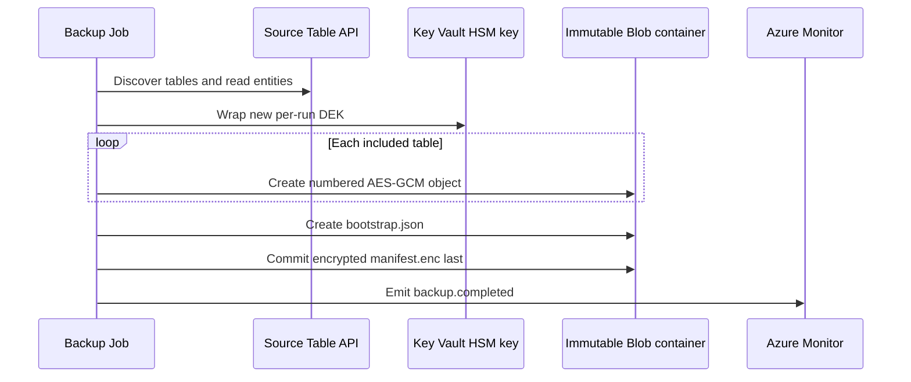
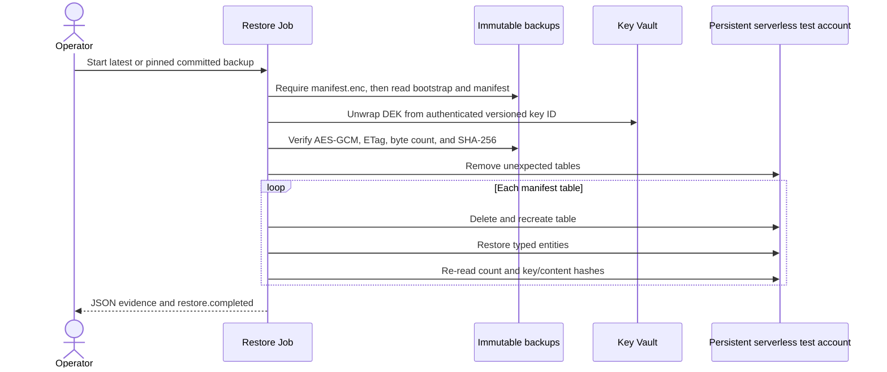

# Backup and restore runbooks

These runbooks operate the deployed platform described in [Deployment and CI/CD](deployment.md). They do not define the backup wire format or cryptography; [Backup format v1](backup-format.md) is authoritative. Apply the [security invariants](security.md) throughout.

## Operating model and gates

Both Azure Container Apps Jobs exist after the first infrastructure deployment. Their mode is controlled by Bicep:

| Operation | `scheduleEnabled` | `restoreAccessEnabled` | `restoreScheduleEnabled` | Effective job mode |
|---|---:|---:|---:|---|
| On-demand backup before acceptance | `false` | `false` | `false` | Backup is manual; restore is manual but has no conditional backup/key/target access |
| Daily backup | `true` | `false` | `false` | Backup uses the configured UTC cron (nonprod default `0 2 * * *`) |
| On-demand restore acceptance | either | `true` | `false` | Restore stays manual and receives conditional access |
| Monthly restore validation | either | `true` | `true` | Restore uses UTC cron (default `0 4 1 * *`) |

The schedules are disabled by default. Manual restore requires `restoreAccessEnabled=true`; `restoreScheduleEnabled` can and should remain false during acceptance. Monthly restore requires both values true. The `deploy-backup.yml` input `enable_restore_validation` sets both together, so it is only for post-acceptance monthly mode—not the initial manual test.

Set these shell variables for the examples:

```bash
export AZURE_BACKUP_SUBSCRIPTION_ID='<backup-subscription-id>'
export AZURE_RESOURCE_GROUP='<backup-resource-group>'
export AZURE_LOCATION='<azure-region>'
export SOURCE_COSMOS_ACCOUNT_RESOURCE_ID='<full-source-account-resource-id>'
export BACKUP_JOB_NAME='<prefix>-daily-backup'
export RESTORE_JOB_NAME='<prefix>-monthly-restore-test'
export IMAGE='<registry>.azurecr.io/cosmos-table-backup@sha256:<digest>'
```

## Backup runbook

### Run an on-demand backup

1. Confirm [source integration](deployment.md#deploy-source-integrationyml--deploy-source-integration) is applied, private DNS resolves the source Table endpoint from the workload network, the job uses the approved digest, and no previous execution is still running.
2. Start the job. A manual start is allowed whether its configured trigger is Manual or Schedule:

   ```bash
   az containerapp job start \
     --subscription "$AZURE_BACKUP_SUBSCRIPTION_ID" \
     --resource-group "$AZURE_RESOURCE_GROUP" \
     --name "$BACKUP_JOB_NAME"
   ```

3. Track execution state:

   ```bash
   az containerapp job execution list \
     --subscription "$AZURE_BACKUP_SUBSCRIPTION_ID" \
     --resource-group "$AZURE_RESOURCE_GROUP" \
     --name "$BACKUP_JOB_NAME" \
     --output table
   ```

4. In workspace-backed Application Insights/Log Analytics, correlate by backup ID and confirm one `backup.completed` event. Completion is emitted only after `manifest.enc` commits. Never infer success from a successful table upload, container exit alone, or a partial `backups/<uuid>/` prefix.

The run discovers tables afresh, excludes exact case-sensitive `cards` before opening its table client, and fails if discovery fails or no included table remains. It streams a logical per-table scan; tables are not captured at one cross-table point in time.



### Accept backup before enabling the schedule

Complete and record this gate in nonproduction:

1. Inspect the guarded deployment what-if; do not relax private networking or RBAC.
2. Verify private DNS from the Container Apps environment.
3. Complete one bounded manual backup and prove that `cards` is absent.
4. Confirm the committed manifest and encrypted objects follow [Backup format v1](backup-format.md).
5. Observe two consecutive scheduled backups after a reviewed temporary schedule enablement, or otherwise exercise the intended schedule under the change procedure.
6. Cause one controlled, reversible failure and verify the `backup.failed` alert; restore the valid configuration immediately.
7. Verify the 26-hour `backup.completed` dead-man alert behavior.
8. Review source request units, latency, and throttling during export.
9. Run the [required negative tests](security.md#required-negative-tests).
10. Validate version-level immutability and lifecycle behavior before the separate irreversible decision to lock the policy.

After acceptance, dispatch **Deploy backup platform** with `enable_schedule=true`, `enable_restore_validation=false`, and `apply=false`. Review `backup-what-if-*`, then repeat with `apply=true`. Do not enable a schedule while the placeholder image is present.

### Monitor backup

The platform creates these always-enabled scheduled-query alerts:

- **backup failure:** severity 1, evaluated every 5 minutes over 10 minutes, when `backup.failed` appears;
- **backup dead-man:** severity 0, evaluated hourly, when no `backup.completed` appears for 26 hours (query override range 48 hours).

The action group uses configured `alertEmails`; the nonproduction default is empty, so alerts exist without email recipients. Validate alert queries against actual `AppTraces` ingestion before enabling the schedule. Application telemetry is allowlisted: event, run ID, numeric table index/count, numeric measurements, status, and sanitized exception type. Table names, object paths, entity keys/values, plaintext/wrapped keys, access tokens, SAS tokens, and connection strings are not telemetry fields. Do not enable unsanitized Azure SDK HTTP logging.

### Interpret stage-level backup telemetry

`table_completed` adds one numeric summary per successful table; `backup.completed` adds the aggregate only after the create-only manifest commit. Existing entity/byte counters and event names remain unchanged. `backup.failed` includes elapsed time and sanitized exception type, not an exception message or partial success summary. A completed table does not imply a completed backup.

All durations are monotonic elapsed milliseconds, not CPU time. Rates use bytes/second (not MiB/second), and zero duration produces zero rates. Counters/totals and maxima use a fixed number of numeric accumulators; no per-entity, per-page, per-block history or percentile sample is retained.

| Fields | Meaning and boundaries |
|---|---|
| `duration_ms`, `entities_per_second` | Table processing including cleanup, or the entire run including discovery, key wrapping and metadata commits. |
| `entity_count`, `byte_count`, `plaintext_byte_count` | Table entity count, encrypted table-object bytes (including 33-byte framing), and encoded entity bytes. Run totals sum table payloads only, excluding bootstrap/manifest bytes. |
| `plaintext_bytes_per_second`, `encrypted_bytes_per_second` | Respective table payload totals divided by the table/run duration. |
| `page_count`, `page_fetch_ms`, `page_fetch_max_ms` | Successful logical SDK page advances (including empty pages), summed advance time, and maximum advance time. The terminal iterator probe contributes time but no count. |
| `stage_block_count`, `stage_block_bytes`, `stage_block_ms`, `stage_block_max_ms` | Successful staged-block count/bytes, summed SDK staging time, and maximum staging time. Run totals include bootstrap/manifest staging as well as table data. |
| `blob_commit_ms` | Summed create-only SDK commit time; run totals include metadata commits. |
| `digest_spill_count`, `digest_spill_bytes`, `digest_spill_ms` | Combined successful spill count/bytes for both digest streams; sorting and spill file-write elapsed time. |
| `digest_merge_ms`, `digest_merge_write_bytes` | Combined final digest calculation time (including in-memory sorting, final spill, consolidation and read/hash); bytes written by intermediate consolidation, not final hashing. Final spill time is nested inside final calculation time: do not sum them as disjoint stages. |
| `digest_scratch_peak_bytes_bound` | Conservative logical-file byte bound: twice combined spill bytes, permitting simultaneous merge input/output. Not a sampled filesystem peak or allocated disk usage. Run value is the maximum table bound because tables are sequential. |
| `local_processing_ms` | Table elapsed time minus page advance, stage and commit time, clamped to zero. Includes serialization, hashes, AES-GCM, digest/scratch I/O, setup, cleanup and instrumentation. Digest timers are subsets of this residual; do not add them again. Run value sums table residuals, excluding run setup/metadata work. |

The pinned Table SDK materializes and converts the returned page before `next(pages)` returns. Consequently page time includes network/retry/backoff, response decoding and SDK entity conversion, but excludes our consumer serialization/encryption work. It is **not pure Cosmos service time**. Staging/commit time likewise includes SDK overhead and retries. These counters are logical operations, **not physical HTTP attempts**, and do not claim retry count, per-request RU charge, or throttling status. Timer contexts close even when an operation raises; failures still propagate and do not emit a success summary.

Use page time as a source-read indicator, staging/commit time as a Blob-write indicator, and the local residual plus digest timings as a CPU/local-I/O indicator. Separate CPU utilization and disk measurements are needed to split CPU from local I/O. Compare stage proportions and external service metrics rather than attributing every millisecond to a server.

### Reproduce the offline synthetic baseline

From the repository root, use the pinned development environment from [CONTRIBUTING](../CONTRIBUTING.md):

```bash
uv sync --frozen --all-extras --no-install-project --no-build
PYTHONPATH=src uv run --frozen --no-sync --no-build python scripts/benchmark-backup.py --tracemalloc
```

The default is one table with 70,000 unique synthetic rows, 16 round-robin partitions, a 256-byte ASCII payload property plus typed keys/ordinal, 1,000 entities/page, 4 MiB blocks, and three alternating enabled/disabled pairs. Defaults for the real pipeline's paging, blocks and digest algorithms are not changed. The workload uses bounded `ItemPaged` pages, actual typed encoding/hashing/AES-GCM/Blob-writer processing, a non-retaining Blob sink, and fake key wrapping. No Azure clients/network calls are constructed. Each run verifies create-only manifest-last completion and scratch cleanup; the discarded bytes and fake wrapped key **do not constitute a recoverable backup**.

The JSON includes settings, application/Python/platform versions, each enabled completion summary, each paired wall duration, median difference, process RSS high-water, and optionally a **separate** tracemalloc pass. The disabled comparison turns off new stage accumulators/clocks, not completion logging, run clocks or metric-call scaffolding: it estimates enabled instrumentation cost, not an exact pre-change binary comparison. Do not run tracemalloc during paired timing. RSS includes imports, all pairs and the traced pass; tracemalloc is Python-tracked allocations only, excluding untracked native SDK/crypto allocations. Neither is a per-table production RSS measurement.

Recorded offline baseline: Python 3.14.7, application 0.1.0, Darwin arm64, pinned `uv.lock` (Table SDK 12.7.0, azure-core 1.41.0, Blob SDK 12.30.3), the default workload above. This is a local measurement, not a service throughput/RU result:

| Measurement | Recorded result |
|---|---:|
| Disabled wall durations | 1504.27, 1523.26, 1522.22 ms |
| Enabled wall durations | 1544.11, 1496.24, 1485.23 ms |
| Median disabled / enabled wall | 1522.22 / 1496.24 ms |
| Median wall difference | −1.71%; within observed run variation, **not evidence of a speedup or a guaranteed overhead bound** |
| Median enabled run throughput | 46,787 entities/s; 21,561,359 plaintext bytes/s; 21,561,381 encrypted bytes/s |
| Payload bytes | 32,258,890 plaintext; 32,258,923 encrypted |
| Page count / median page time | 70 / 29.92 ms |
| Table blocks / run blocks | 8 / 10 (including bootstrap/manifest) |
| Median run stage / commit time | 0.008 / 0.008 ms (discard sink; not Blob latency) |
| Median local / final digest / spill time | 1466.10 / 76.40 / 27.32 ms (nested digest timings) |
| Digest spills / bytes / intermediate merge writes | 6 / 4,480,000 / 0 bytes |
| Logical scratch bound | 8,960,000 bytes |
| Separate traced allocation peak | 13,632,916 bytes |
| Process lifetime RSS high-water | 305,168,384 bytes (includes traced pass) |

The default exercises disk spills, but not fan-in consolidation; bounded consolidation is covered by unit tests. Each digest stream retains at most 32,768 32-byte digests plus bounded merge buffers (fan-in 32), while Python object/list overhead and the configured page/block buffers also consume memory. Instrumentation adds a fixed field dictionary per active table/run; it introduces no task/queue concurrency. The scratch byte bound scales with spilled entity count and is not a disk quota. Larger runs require sufficient approved scratch capacity.

To demonstrate discrimination without claiming service behavior, repeat controlled delays:

```bash
PYTHONPATH=src uv run --frozen --no-sync --no-build python scripts/benchmark-backup.py --entities 1000 --page-size 100 --block-size 65536 --page-delay-ms 20
PYTHONPATH=src uv run --frozen --no-sync --no-build python scripts/benchmark-backup.py --entities 1000 --page-size 100 --block-size 65536 --stage-delay-ms 20
```

Three-pair median enabled results on the same host were respectively: run/page/stage/local **411.20/283.82/0.03/126.18 ms**, and **396.10/2.60/282.46/113.29 ms**. Scheduler sleep overshoot is included; these are simulated waits, not measured Cosmos or Blob latency. The zero-delay baseline is predominantly local processing. Repeat measurements on a quiet host, retain numeric JSON with the commit/lock/image identity, and compare identical workloads; do not generalize these small samples to production.

### Correlate with Azure Monitor and complete the real-service gate

**An explicitly approved nonproduction benchmark is still required. No Azure benchmark, RU/throttle correlation, deployment or production access is authorized by the offline procedure.** Obtain approval for the synthetic source, destination, region/capacity mode, entity population, RU/cost budget, run count and cleanup first. Populate only the approved synthetic nonproduction source using an independently authorized writer; the backup identity remains read-only and never writes to the production source.

1. Record the exact commit, image digest, lockfile/SDK versions, job CPU/memory limits, page/block settings, entity size/count/property mix and partition distribution. Use the same workload for each comparison. Keep `cards` and configured exclusions protected; do not change concurrency, encryption or verification to improve the result.
2. Capture the execution's UTC start/end and backup ID. Verify a committed manifest and all integrity/restore checks under existing nonproduction acceptance gates. Record numeric completion summaries and external CPU/RSS/disk observations; retain no source keys/values or raw SDK response/header logs.
3. Inspect the **actual Table account's** metric definitions and available dimensions in Azure Monitor. Correlate available request counts/status (including 429), latency and RU/capacity metrics over the same UTC window, at their supported grain (often one minute). Where present, filter account/database/table or collection, region and read operation; isolate other traffic. The service does not share our backup ID: correlation is temporal, not a per-request join.
4. Record exact metric names, dimensions, aggregation, grain, missing metrics and background traffic. Use sum for count/consumed-unit metrics where supported, and documented latency aggregations. Check retry/backoff overlap against page/staging durations, but do not derive physical attempt counts from logical page counts. A retry-hidden 429 may not reach the application; external status metrics are essential.
5. Verify API applicability before reporting RU: the published database-account catalog describes `TotalRequestUnits` as **SQL** request units. Its availability/name is not evidence of Table API charge accounting. If Table-specific RU/status/latency evidence cannot be obtained through supported account metrics or approved diagnostics, mark that gate unresolved rather than substituting SQL behavior or estimating charges from entities. `ServerSideLatency` is deprecated; validate the account/API applicability of replacement gateway/direct latency metrics before using them.
6. Compare repeated identical runs and separately measure enabled instrumentation overhead/resources. Report workload, elapsed/rates, page/stage/digest timings, peak memory/scratch methodology, RU/throttling availability and limitations. Only after this evidence is recorded can the real-service acceptance criterion be marked complete.

References: [SDK PageIterator](https://learn.microsoft.com/python/api/azure-core/azure.core.paging.pageiterator?view=azure-python), [monitor Azure Cosmos DB](https://learn.microsoft.com/en-us/azure/cosmos-db/monitor), and [database-account supported metrics](https://learn.microsoft.com/en-us/azure/azure-monitor/reference/supported-metrics/microsoft-documentdb-databaseaccounts-metrics). SQL examples in these references do not establish Table-specific SDK charge/retry behavior.

### Triage a failed backup

| Symptom | Action |
|---|---|
| No `manifest.enc` | Treat the run as failed. Preserve partial blobs for investigation; lifecycle management handles them later. Never restore the prefix. |
| Cosmos 401/403 | Check the source Table data-plane reader assignment and managed-identity audience. Do not enable keys. |
| Name resolution/connectivity | Check private endpoint approval, private DNS links, NSG/platform dependencies, and the source endpoint. Do not enable public access as a workaround. |
| Cosmos 429 | Reduce configured page size/concurrency or move the schedule; stay inside the accepted RU budget. |
| Key wrap failure | Confirm the exact versioned HSM key is enabled and the backup identity has metadata/wrap only. |
| Blob conflict | Use a new run ID. Never overwrite an immutable object. |

## Restore-validation runbook

### Understand the target before enabling access

The dedicated restore account is provisioned **unconditionally** with the platform and persists between tests. It is a private, local-auth-disabled Cosmos DB for Table account in serverless capacity mode, with no fixed provisioned RU/s. Its resource ID must differ from the source, and the runtime repeats that identity/endpoint check before any data-plane operation.

A restore execution never creates the account. It deletes unexpected user tables, then deletes and recreates each manifest table. After success, restored data remains in the persistent test account until an operator cleans it up, runs another validation that recreates it, or tears down the account. It is not a production restore destination.

### Run an on-demand restore validation

1. Choose a successfully committed backup. If no UUID is supplied, the restore selects the `manifest.enc` with the newest Blob `last_modified` value. To test a specific committed backup, retain its UUID for step 4.
2. Enable access **without** enabling the schedule. Because the current workflow couples the flags, perform the same reviewed subscription deployment locally (or through an equivalently protected approved pipeline):

   ```bash
   export BACKUP_SCHEDULE_ENABLED='true' # use false if daily backup is not yet accepted
   export ALLOW_ROLE_ASSIGNMENT_CHANGES=1
   az deployment sub what-if \
     --subscription "$AZURE_BACKUP_SUBSCRIPTION_ID" \
     --location "$AZURE_LOCATION" \
     --template-file infra/main.bicep \
     --parameters infra/parameters/nonprod.bicepparam \
     --parameters sourceCosmosAccountResourceId="$SOURCE_COSMOS_ACCOUNT_RESOURCE_ID" \
                  backupImage="$IMAGE" \
                  scheduleEnabled="$BACKUP_SCHEDULE_ENABLED" \
                  restoreAccessEnabled=true \
                  restoreScheduleEnabled=false \
     --result-format FullResourcePayloads --output json > what-if.json
   python3 scripts/guard-what-if.py
   ```

   Review `what-if.json` under the same change-control standard as the protected environment, then replace `what-if` with `create` (and omit `--result-format FullResourcePayloads`) using identical parameters. This creates the four conditional grants: Blob read, key metadata/unwrap, telemetry publishing, and target Cosmos data contribution.
3. Start the latest committed backup test:

   ```bash
   az containerapp job start \
     --subscription "$AZURE_BACKUP_SUBSCRIPTION_ID" \
     --resource-group "$AZURE_RESOURCE_GROUP" \
     --name "$RESTORE_JOB_NAME"
   ```

   Or pin a committed UUID for this execution:

   ```bash
   export BACKUP_ID='<committed-backup-uuid>'
   az containerapp job start \
     --subscription "$AZURE_BACKUP_SUBSCRIPTION_ID" \
     --resource-group "$AZURE_RESOURCE_GROUP" \
     --name "$RESTORE_JOB_NAME" \
     --container-name restore-validation \
     --env-vars RESTORE_BACKUP_ID="$BACKUP_ID"
   ```

4. Monitor the execution list as for backup, substituting `RESTORE_JOB_NAME`. Inspect the container output for the JSON verification report and query `AppTraces` for exactly one matching `restore.completed`. A missing or nonzero execution, `restore.failed`, or absent report is a failed validation.



### What a successful restore proves

Before writing a table, the job authenticates the bootstrap-bound encrypted manifest, validates its schema/object paths, unwraps the DEK with RSA-OAEP-256, and reads the immutable table object conditionally against one ETag. It verifies encrypted size/SHA-256 and plaintext SHA-256. It then recreates the table, restores typed records, repeats source-object verification, and re-enumerates the target.

Success requires exact table-set equality and, for every table, equality of manifest entity count, order-independent entity-key hash, and persisted-content hash. The JSON report includes backup ID, target endpoint, table/entity counts, per-table encrypted/plaintext/key/content hashes, and an overall deterministic report hash; it includes no entity values. See [Restore protocol](backup-format.md#restore-protocol) for the authoritative algorithm and failure semantics.

### Accept restore before enabling monthly validation

1. Complete a manual test with `restoreAccessEnabled=true` and `restoreScheduleEnabled=false`.
2. Confirm isolated source/target IDs, private DNS, keyless access, selected backup UUID, exact table set, counts/hashes, JSON report, and `restore.completed`.
3. Exercise a controlled failed validation and confirm `restore.failed` alerting.
4. Review data retention and operator cleanup evidence.
5. Close the temporary access window and verify the four conditional grants are gone as described below.
6. Obtain security/operations approval for continuously active restore-only grants.
7. Dispatch **Deploy backup platform** with `enable_restore_validation=true` and the accepted backup schedule setting, first `apply=false` and then `apply=true` after reviewing the artifact. This enables both restore access and the monthly trigger.

The restore failure alert is always present (severity 1, every 5 minutes over 10 minutes). The 35-day restore success dead-man alert is severity 0, evaluated daily, and exists only while both access and schedule are enabled.

### Clean up restored data and close access

Cleanup is operator-owned. The next restore removes unexpected tables and recreates expected tables, but it does not empty the persistent account after evidence collection. While an approved data-plane identity is available, remove the test tables according to organizational procedure and verify that no user tables remain. Do not grant keys or public access to simplify cleanup.

Redeploy with `restoreAccessEnabled=false` and `restoreScheduleEnabled=false`. **That incremental ARM deployment does not remove conditional role assignments created by an earlier deployment.** Explicitly remove and verify these assignments for the restore identity:

1. Storage Blob Data Reader on the backup container;
2. the custom `<prefix> Key metadata and unwrap only` assignment on the Key Vault key;
3. Monitoring Metrics Publisher on Application Insights; and
4. Cosmos DB built-in data contributor on the restore-test account.

Use assignment IDs from Azure rather than broad name-based deletion, preserve the always-present ACR pull needed to start the dormant job, and record effective-access verification. An Azure Deployment Stack configured to delete resources that become unmanaged is the alternative documented in the [infrastructure reference](../infra/README.md#deployment-order).

### Respond to a failed restore

- Guard/configuration errors exit with code 2; data/authentication/write failures exit nonzero and emit `restore.failed`.
- A missing committed marker, malformed metadata, wrong key version, nonce/AAD/tag/hash/count mismatch, changed Blob ETag, oversized record, or target write failure must never be overridden.
- A failure can leave a partially populated recreated table. After correcting the cause, rerun the complete restore; it deletes/recreates that table and repeats every check.
- Never reinterpret isolated validation as permission or a procedure to write to the production source.

## Teardown

1. Disable both schedules and restore access through reviewed deployment.
2. Wait for all Container Apps Job executions to finish.
3. Remove the four conditional restore assignments explicitly and verify the source-side reader/private-endpoint integration is removed under source-subscription change control.
4. Clean test data. To remove only the restore account, delete it under operator approval; because it is an unconditional Bicep resource, any later full platform deployment recreates it.
5. Before deleting the platform/resource group, account for immutable backup retention, soft delete/purge protection, source integration, DNS/private endpoints, alerting, and evidence-retention requirements. Do not attempt to bypass locked WORM retention.

Return to [Deployment and CI/CD](deployment.md) for promotion/rollback and production fork procedures, or [Security invariants](security.md) for negative tests and release blockers.
