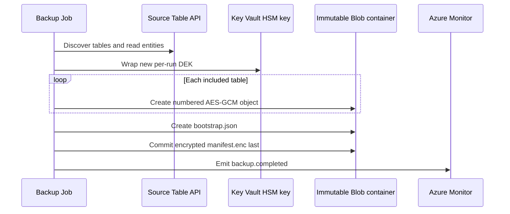

# Backup and restore runbooks

These runbooks operate the deployed platform described in [Deployment and CI/CD](deployment.md). They do not define the backup wire format or cryptography; [Backup format v1](backup-format.md) is authoritative. Apply the [security invariants](security.md) throughout.

## Operating model and gates

Both Azure Container Apps Jobs exist after the first infrastructure deployment. Their mode is controlled by Bicep:

| Operation | `scheduleEnabled` | `restoreAccessEnabled` | `restoreScheduleEnabled` | Effective job mode |
|---|---:|---:|---:|---|
| On-demand backup before acceptance | `false` | `false` | `false` | Backup is manual; restore is manual but has no conditional backup/key/target access |
| Daily backup | `true` | `false` | `false` | Backup uses the configured UTC cron (nonprod default `0 2 * * *`) |
| On-demand restore acceptance | either | `true` | `false` | Restore stays manual and receives conditional access |
| Monthly restore validation | either | `true` | `true` | Restore uses UTC cron (default `0 4 1 * *`) |

The schedules are disabled by default. Manual restore requires `restoreAccessEnabled=true`; `restoreScheduleEnabled` can and should remain false during acceptance. Monthly restore requires both values true. Use `deploy-backup.yml` with `enable_restore_access=true` and `enable_restore_validation=false` for manual acceptance. The legacy `enable_restore_validation=true` still enables both access and monthly scheduling, regardless of the access-only input; use it only after acceptance.

Set these shell variables for the examples:

```bash
export AZURE_BACKUP_SUBSCRIPTION_ID='<backup-subscription-id>'
export AZURE_RESOURCE_GROUP='<backup-resource-group>'
export AZURE_LOCATION='<azure-region>'
export SOURCE_COSMOS_ACCOUNT_RESOURCE_ID='<full-source-account-resource-id>'
export BACKUP_JOB_NAME='<prefix>-daily-backup'
export RESTORE_JOB_NAME='<prefix>-monthly-restore-test'
export IMAGE='<registry>.azurecr.io/cosmos-table-backup@sha256:<digest>'
```

## Backup runbook

### Run an on-demand backup

1. Confirm [source integration](deployment.md#deploy-source-integrationyml--deploy-source-integration) is applied, private DNS resolves the source Table endpoint from the workload network, the job uses the approved digest, and no previous execution is still running.
2. Start the job. A manual start is allowed whether its configured trigger is Manual or Schedule:

   ```bash
   az containerapp job start \
     --subscription "$AZURE_BACKUP_SUBSCRIPTION_ID" \
     --resource-group "$AZURE_RESOURCE_GROUP" \
     --name "$BACKUP_JOB_NAME"
   ```

3. Track execution state:

   ```bash
   az containerapp job execution list \
     --subscription "$AZURE_BACKUP_SUBSCRIPTION_ID" \
     --resource-group "$AZURE_RESOURCE_GROUP" \
     --name "$BACKUP_JOB_NAME" \
     --output table
   ```

4. In workspace-backed Application Insights/Log Analytics, correlate by backup ID and confirm one `backup.completed` event. Completion is emitted only after `manifest.enc` commits. Never infer success from a successful table upload, container exit alone, or a partial `backups/<uuid>/` prefix.

The run discovers tables afresh, excludes exact case-sensitive `cards` before opening its table client, and fails if discovery fails or no included table remains. It streams a logical per-table scan; tables are not captured at one cross-table point in time.



### Accept backup before enabling the schedule

Complete and record this gate in nonproduction:

1. Inspect the guarded deployment what-if; do not relax private networking or RBAC.
2. Verify private DNS from the Container Apps environment.
3. Complete one bounded manual backup and prove that `cards` is absent.
4. Confirm the committed manifest and encrypted objects follow [Backup format v1](backup-format.md).
5. Observe two consecutive scheduled backups after a reviewed temporary schedule enablement, or otherwise exercise the intended schedule under the change procedure.
6. Cause one controlled, reversible failure and verify the `backup.failed` alert; restore the valid configuration immediately.
7. Verify the 26-hour `backup.completed` dead-man alert behavior.
8. Review source request units, latency, and throttling during export.
9. Run the [required negative tests](security.md#required-negative-tests).
10. Validate version-level immutability and lifecycle behavior before the separate irreversible decision to lock the policy.

After acceptance, dispatch **Deploy backup platform** with `enable_schedule=true`, `enable_restore_validation=false`, and `apply=false`. Review `backup-what-if-*`, then repeat with `apply=true`. Do not enable a schedule while the placeholder image is present.

### Monitor backup

The platform creates these always-enabled scheduled-query alerts:

- **backup failure:** severity 1, evaluated every 5 minutes over 10 minutes, when `backup.failed` appears;
- **backup dead-man:** severity 0, evaluated hourly, when no `backup.completed` appears for 26 hours (query override range 48 hours).

The action group uses configured `alertEmails`; the nonproduction default is empty, so alerts exist without email recipients. Validate alert queries against actual `AppTraces` ingestion before enabling the schedule. Application telemetry is allowlisted: event, run ID, numeric table index/count, numeric measurements, status, and sanitized exception type. Table names, object paths, entity keys/values, plaintext/wrapped keys, access tokens, SAS tokens, and connection strings are not telemetry fields. Do not enable unsanitized Azure SDK HTTP logging.

### Bounded async upload settings

Backup uses the pinned Azure async Table, Blob and Key Vault clients. Tables remain sequential. For each table, one source producer advances one logical continuation pager sequentially, reserving a single source slot **before** fetching a page. The slot holds either an in-progress fetch or one queued materialized SDK page; a full slot prevents another fetch. The consumer releases the slot when it takes that page and yields cooperatively once, allowing the next read to start before serialization. Serialization, hashing and each object's AES-GCM stream remain single-consumer operations. Empty and partial pages retain SDK order and continuation behavior; no PartitionKey discovery or concurrent requests from one pager are added.

A separate bounded queue overlaps completed encrypted-block uploads with entity processing and source page reads. All source work and client cleanup must succeed before table finalization/commit, and all queued uploads finish before the create-only object commit; idle upload workers remain alive until writer context exit cancels and awaits them. `manifest.enc` remains last. SDK retries/backoff are unchanged. Async data-plane clients and their credential close only after producer/worker cleanup; the synchronous Monitor credential has a separate lifecycle. Restore's synchronous SDK path is unchanged.

Each complete-block enqueue and newly consumed source page yields cooperatively so tasks can progress even when queues have capacity. Writes that only append to the producer buffer do not force an event-loop turn per entity; source reads and queue backpressure remain async cancellation boundaries.

| Environment setting | Default | Accepted range |
|---|---|---|
| `BACKUP_UPLOAD_CONCURRENCY` | `2` | `1`–`8` active uploads per object |
| `BACKUP_UPLOAD_QUEUE_BLOCKS` | `2` | `1`–`8` waiting complete blocks |
| `BACKUP_BLOCK_SIZE` | `4194304` (4 MiB) | 64 KiB–100 MiB |
| `BACKUP_PAGE_SIZE` | `500` | `1`–`1000` entities per source page |

Invalid settings fail configuration before data-plane access. Defaults apply when settings are omitted; deployments may supply explicit environment values. Concurrency `1` still overlaps production with upload and is **not** the old inline-staging baseline.

**Memory accounting:** let B be block size, Q queue capacity and C upload concurrency. At most Q queued immutable blocks, C worker-held blocks, one pending producer block and one producer assembly buffer are live. Conversion briefly retains both the assembly buffer and its immutable copy; Python bytearray growth can exceed its logical length. `(Q + C + 3) × B` is a conservative application-owned block-payload allocation budget at supported block sizes, including that growth/copy overlap. Workers release their last payload before waiting for another block, and no task is created per block.

The pinned Blob helper uses an exact-length bytes slice (no new payload for a full bytes slice); its async HTTP transport and aiohttp bytes payload reuse that immutable request body. Retries reuse it rather than queueing additional requests. Socket/TLS writes can retain additional native copies: budget a further `3 × C × B` for transport/TLS payload working space, giving a conservative upload planning allowance of `(Q + 4C + 3) × B` (52 MiB at defaults). This is **not** a hard process-RSS ceiling or a guarantee about native allocator/kernel buffers.

**Source bounds:** there is exactly one producer task and one reserved/queued-page slot per active table, alongside C upload workers and the orchestration task. No tasks are created per entity or page. Application page references cover at most one consumer page and one next page, up to `2 × BACKUP_PAGE_SIZE` entities under the SDK/service page-size contract, plus the caller's current entity reference. The queue carries SDK iterators without copying entity payloads. Exhausted consumer pages and queued references are released on completion/error.

The pinned Table 12.7.0 / azure-core pager materializes typed entities and retains the latest page iterator and deserialized response. Its iterator aliases the delivered page, rather than adding another independent entity page; response JSON and conversion buffers are separate allocations. During the next request, the old response can coexist with new network/JSON/conversion buffers. Budget these transient SDK/transport terms in addition to the two entity pages; page size bounds entity count, not payload bytes or process RSS.

Total working memory also includes current entity/JSON/encoded plaintext and ciphertext (including transient serialization/encryption copies), manifest/bootstrap serialization, two fixed-size digest sort buffers and bounded merge readers, at most 50,000 block-ID descriptors/commit XML, client/telemetry state and Python/native allocator overhead. These terms depend on configured page size, maximum entity/encoded-record size, table count, digest settings and transport implementation, not accumulated entity count. Increasing page or block settings requires including these separate terms in the job's memory limit and measuring RSS. Digest scratch still scales with entity count and uses the documented bounded merge fan-in; source buffering and upload staging add no scratch files.

On source/consumer/upload failure or async cancellation, structured task groups interrupt blocked sibling stages, cancel and await the source producer and upload workers, close the table client and discard queued references/payloads. A failed table is not committed and no later manifest is attempted. Source cleanup failure also prevents completion. Already staged uncommitted blocks may remain. Cancellation during a server commit can leave its acceptance unknown; do not infer marker absence from a lost response or retry by overwriting. CPU serialization/digest work is cooperative, not forcibly preemptible; cancellation takes effect at async boundaries. No speedup is implied by these settings.

### Interpret stage-level backup telemetry

`table_completed` adds one numeric summary per successful table; `backup.completed` adds the aggregate only after the create-only manifest commit. Existing entity/byte counters and event names remain unchanged. `backup.failed` includes elapsed time and sanitized exception type, not an exception message or partial success summary. A completed table does not imply a completed backup.

The logger accepts only built-in integers and finite built-in floats for measurement fields, including existing table/entity/byte counts and duration. It silently drops structured values, strings, booleans, numeric subclasses and non-finite floats before JSON serialization; invalid measurements do not interrupt the backup.

All durations are monotonic elapsed milliseconds, not CPU time. Rates use bytes/second (not MiB/second), and zero duration produces zero rates. Counters/totals and maxima use a fixed number of numeric accumulators; no per-entity, per-page, per-block history or percentile sample is retained.

| Fields | Meaning and boundaries |
|---|---|
| `duration_ms`, `entities_per_second` | Table processing including cleanup, or the entire run including discovery, key wrapping and metadata commits. |
| `entity_count`, `byte_count`, `plaintext_byte_count` | Table entity count, encrypted table-object bytes (including 33-byte framing), and encoded entity bytes. Run totals sum table payloads only, excluding bootstrap/manifest bytes. |
| `plaintext_bytes_per_second`, `encrypted_bytes_per_second` | Respective table payload totals divided by the table/run duration. |
| `page_count`, `page_fetch_ms`, `page_fetch_max_ms` | Successful logical SDK page advances (including empty pages), summed advance time, and maximum advance time. The terminal iterator probe contributes time but no count. |
| `source_wait_ms` | Consumer elapsed time waiting for a queued source page or end-of-stream. Excludes entity processing and producer reads that overlap downstream work. |
| `source_backpressure_ms` | Source producer elapsed time reserving the next-page slot; includes time waiting for the consumer to take the queued page. Overlaps consumer/upload work; not an additive wall-time stage. |
| `stage_block_count`, `stage_block_bytes`, `stage_block_ms`, `stage_block_max_ms` | Successful staged-block count/bytes, summed SDK staging time, and maximum staging time. Uploads overlap: summed time can exceed wall time and is not an additive stage fraction. Run totals include bootstrap/manifest staging as well as table data. |
| `upload_wait_ms` | Producer wall time enqueueing complete blocks and draining outstanding uploads before commit; includes bounded-queue backpressure. Not total upload wall time or a pure idle/CPU measurement. Run totals include metadata writers. |
| `blob_commit_ms` | Summed create-only SDK commit time; run totals include metadata commits. |
| `digest_spill_count`, `digest_spill_bytes`, `digest_spill_ms` | Combined successful spill count/bytes for both digest streams; sorting and spill file-write elapsed time. |
| `digest_merge_ms`, `digest_merge_write_bytes` | Combined final digest calculation time (including in-memory sorting, final spill, consolidation and read/hash); bytes written by intermediate consolidation, not final hashing. Final spill time is nested inside final calculation time: do not sum them as disjoint stages. |
| `digest_scratch_peak_bytes_bound` | Conservative logical-file byte bound: twice combined spill bytes, permitting simultaneous merge input/output. Not a sampled filesystem peak or allocated disk usage. Run value is the maximum table bound because tables are sequential. |
| `local_processing_ms` | Table elapsed time minus consumer source wait, producer upload wait and commit time, clamped to zero. Overlapping page-fetch and staging durations are not subtracted. Includes serialization, hashes, AES-GCM, digest/scratch I/O, cooperative yields, setup, source cleanup and instrumentation. Digest timers are subsets of this residual; do not add them again. Run value sums table residuals, excluding run setup/metadata work. |

The pinned Table SDK materializes and converts the returned page before `await anext(pages)` returns. Consequently page time includes network/retry/backoff, response decoding and SDK entity conversion, but can also include event-loop scheduling delays while downstream CPU work runs. It is **not pure Cosmos service time**. Staging/commit time likewise includes SDK overhead and retries. These counters are logical operations, **not physical HTTP attempts**, and do not claim retry count, per-request RU charge, or throttling status. Timer contexts close even when an operation raises; failures still propagate and do not emit a success summary. Observe available Table-specific Azure Monitor request/429/RU series separately; incomplete buckets do not prove zero retries or throttling.

Use page time and consumer source waits as source-read indicators, staging/commit time and producer upload waits as Blob-write indicators, and the local residual plus digest timings as a CPU/local-I/O indicator. Separate CPU utilization and disk measurements are needed to split CPU from local I/O. Concurrent stage timers overlap; do not sum them or treat them as mutually exclusive wall-time proportions. Historical inline-staging and no-prefetch residuals below are not directly comparable to the new residual definition.

### Historical test results (2026-09-30)

These are results of completed synthetic tests, retained only as historical evidence. The experiment code, dedicated tests, infrastructure and execution procedures are not part of the project; no repeat of these experiments is currently planned. The results are workload-specific observations, not current performance guarantees or evidence of successful restore validation.

Six approved Azure backups used 70,000 entities, 16 partitions, 256-byte payloads, 500-entity pages, 4 MiB blocks and 1 CPU / 2 GiB per job. The independently counted `cards` canary was excluded. Table source capacity was 4,000 RU/s plus 400 RU/s for `cards`; Python 3.14 and pinned dependencies were used. Image digest: `sha256:f8da4bf43a5bde9adc1f887b237792b8960ef118b4ae094690dfa0bcc64526e3`.

| Measurement | Result |
|---|---|
| Median enabled / disabled wall time | 12.774 / 12.291 s; 3.93% difference across three pairs, not an established overhead bound |
| Source paging / local residual / Blob writes | 61.7–64.9% / 24.3–26.2% / 8.9–14.0% of table elapsed |
| Process RSS high-water | 100,110,336–102,277,120 bytes; includes native allocations |
| Digest spill bytes / logical scratch bound | 4,480,000 / 8,960,000 bytes; bound is not measured disk usage or a quota |
| Azure Monitor, UTC 12:52–12:58, PT1M | Normalized RU maxima 15–23%; average throttling 0%; no induced 429 test |
| Table GET/200 requests / gateway latency | 140 requests and 26.079 / 26.350 ms in only two minute buckets; other buckets incomplete |

Source paging dominated this workload, but includes SDK conversion/retries, not just server time. Exact Table per-backup RU charges and complete throttling correlation were not established. The earlier offline discard-sink comparison measured −1.71% median variation and a 13,632,916-byte traced allocation peak; these are not Azure throughput or guaranteed overhead bounds.

**Restore gate remains unresolved:** the isolated restore failed with HTTP 403 at `TableServiceClient.delete_table` despite Table-native contributor access. Initial enumeration also failed until an operator initialized an empty table through ARM. No successful count/key/content/table-set verification was produced. Do not infer that SQL grants are appropriate, bypass delete/recreate or enable scheduled validation.

Dedicated Azure test resources, identity grants, images, DNS and deployment records were removed and verified; shared infrastructure remained present. Encrypted synthetic backups remain under the existing 14-day Blob lifecycle policy because operator access was network-blocked; physical deletion is unverified. Detailed historical test evidence remains in [issue #25](https://github.com/smereczynski/CosmosDB-Table-Backup/issues/25).

### Authorized async-staging comparison (2026-10-01)

This separately authorized, completed nonproduction comparison for [issue #29](https://github.com/smereczynski/CosmosDB-Table-Backup/issues/29) used a dedicated synthetic source table, private/keyless Blob storage and HSM Key Vault, separate backup/restore identities, and an isolated metadata-write-protected restore account. Existing source tables and existing identity grants were preserved. The one-off harness and infrastructure remain session artifacts, not supported repeat procedures or project tooling.

The workload was 20,000 entities in 16 partitions with 4,096-byte payloads, 500-entity sequential pages, 4 MiB blocks and 4,000 source RU/s, on the existing private `Standard_B2ats_v2` runner. Each backup read 40 pages and produced 85,908,923 encrypted table bytes in 21 blocks. The inline baseline was commit `eff4756d40550356c3c215b980532ba2bee0639d`; the candidate used concurrency `2` and queue capacity `2`. Both used Python 3.14.0 and pinned Table 12.7.0, Blob 12.30.3, Identity 1.25.3, Key Vault 4.11.0 and cryptography 50.0.1; the candidate added aiohttp 3.14.3. One warmup per implementation was excluded before three alternating baseline/candidate pairs.

| Measurement | Inline baseline | Async candidate |
|---|---|---|
| Elapsed samples, seconds | 6.846606 / 6.982630 / 8.578291 | 5.216128 / 5.815972 / 5.857955 |
| Median elapsed, seconds | 6.982630 | 5.815972 |
| Median encrypted throughput, bytes/second | 12,303,233 | 14,771,206 |
| Process RSS high-water range, bytes | 101,089,280–102,760,448 | 113,651,712–117,444,608 |
| Producer upload wait samples, milliseconds | N/A: inline staging | 58.237 / 55.849 / 47.374 |
| Digest logical scratch bound / residual directories | 0 bytes / 0 | 0 bytes / 0 |

The candidate median elapsed time was **16.708% lower on this workload**, with higher observed RSS. Async Table paging and Blob upload overlap changed together; the difference cannot be attributed solely to staging or generalized into a guaranteed speedup. This workload stayed below the digest spill threshold, so the zero scratch result does not validate spill performance or a general memory ceiling.

Both backups authenticated with the unchanged restore planner and produced matching decrypted-table SHA-256 values and independently generated count/key/content digests. Candidate isolated restore verified 20,000 entities and matching key/content digests; a separate ARM readback verified the exact authenticated target table set after runtime reported `data_verified_pending_table_set`. Real-service checks confirmed create-only conflict rejection without changing existing ciphertext, and denied backup-identity Blob deletion, Key Vault unwrap and synthetic-source writes. Offline regressions separately cover failure/cancellation propagation, deterministic block order, bounded backpressure, the block limit and exact synchronous/async v1 ciphertext framing.

Filtered Azure Monitor data in the UTC 11:25–11:26 PT1M bucket reported maximum normalized RU of 98% and zero returned 429 requests. `ThrottledRequestPercentage` returned no series. Exact per-backup RU charges, complete throttling correlation and performance under induced backup throttling were not established; seeding retries are not backup evidence.

The tested candidate source and both dependency manifests matched the worktree byte-for-byte at comparison time and were subsequently committed as `9391bd30ddf6d320fb42d28d67fb6a6d4832dfb7`. Candidate archive SHA-256: `576ea9a394289f514d1bc963d034cab82df1facdf5f367f58b65f3e31b47da0d`. The later PR review follow-up restricts cooperative yields to complete-block enqueues; these Azure measurements predate that change and were not rerun.

Local validation for that measured candidate used Python 3.14.7, uv 0.12.19 and `PYTHONPATH=src`. `uv lock --check` passed. The commands below all use the prefix `uv run --frozen --no-sync --no-build`:

| Command suffix | Result |
|---|---|
| `ruff format --check .` | Passed: 40 files formatted |
| `ruff check .` | Passed |
| `mypy src` | Passed: 16 source files |
| `pytest -q` | Passed: 584 tests, 95.67% coverage |
| `pip-audit` | Passed: no known vulnerabilities |
| `bandit -q -r src` | Passed |

Changed-document local links and `git diff --check` passed. The initial local pytest invocation omitted the documented `PYTHONPATH` export and failed collection; the corrected invocation above passed without dependency or source changes. No repository infrastructure or container changes were made, so repository Bicep/container checks were not rerun.

Cleanup removed the dedicated storage/backups, isolated restore account, source fixture table, private endpoints/NICs, new DNS records/zones/links, identity grants, custom role definitions, identities, deployment record and runner artifacts. Readback confirmed all 14 original resources, both original VM identities, the original source table and native role assignments, and the original Table private DNS zone/link remained. The purge-protected vault and key are soft-deleted with scheduled purge at **2026-10-08 11:45:20 UTC**; purge protection and the seven-day retention were not weakened.

### Authorized bounded-source comparison (2026-10-01)

The separately authorized [issue #33](https://github.com/smereczynski/CosmosDB-Table-Backup/issues/33) comparison used the retained private/keyless fixture below, not production data. The dedicated source contained 20,000 synthetic entities, 16 partitions and 4,096-byte string payloads. Each run used 500-entity pages and 4 MiB blocks, read 40 logical pages and produced 85,120,033 encrypted table bytes in 21 blocks. Source throughput was **400 RU/s**, not the previous staging experiment's 4,000 RU/s; results are not directly comparable between experiments.

The private `Standard_B2ats_v2` runner used Python 3.14.0 and pinned Table 12.7.0, Identity 1.25.3, Key Vault 4.11.0, Blob 12.30.3 and cryptography 50.0.1. The synchronous baseline was `eff4756d40550356c3c215b980532ba2bee0639d`; the async/no-prefetch control was `7bb69cda253b06308eefb095929af53d1f5c6ace`. Candidate/control dependency manifests were byte-identical and shared the same pinned environment, including aiohttp 3.14.3. The candidate archive SHA-256 was `d93a5c7de87df67b0679f4ab433f813ff3894a11e862a41f925e044ae1a8c0bc`; all 16 application source files matched the measured archive. One warmup per implementation was excluded before three balanced rounds, ordered baseline/control/candidate, candidate/baseline/control and control/candidate/baseline.

| Measurement | Synchronous baseline | Async/no-prefetch control | Bounded-source candidate |
|---|---|---|---|
| Elapsed samples, seconds | 21.739877 / 23.548343 / 27.127125 | 29.213016 / 27.825651 / 25.291530 | 27.974834 / 33.253695 / 25.830546 |
| Median elapsed, seconds | 23.548343 | 27.825651 | 27.974834 |
| Median encrypted throughput, bytes/second | 3,614,693 | 3,059,049 | 3,042,736 |
| RSS high-water range, bytes | 101,556,224–103,403,520 | 114,307,072–117,518,336 | 116,989,952–117,452,800 |
| Sampled async task peaks | N/A: synchronous | 4 / 5 / 5 | 6 / 6 / 5 |
| Sampled digest scratch peak | 0 bytes | 0 bytes | 0 bytes |

**No speedup was demonstrated:** candidate median elapsed was 0.536% higher than the no-prefetch control and 18.797% higher than the synchronous baseline. Three samples do not establish statistical significance or a general regression/overhead bound. The synchronous comparison changes both Table/Blob I/O architecture and dependencies; only the no-prefetch control isolates the new source producer. This RU-constrained workload does not establish throughput on a higher-capacity or differently distributed source.

All twelve backup runs succeeded and authenticated with the unchanged restore planner. Independent expected count/key/content digests matched their authenticated manifests; authenticated plaintext SHA-256 was identical across all twelve backups. Discovery used the real Table service, configured exclusions for every nonfixture table, and a separate guard rejecting any nonfixture table client. Exact `cards` was additionally injected as discovery metadata to test exclusion; no new `cards` source table/canary was created or opened.

The final measured candidate backup `9ae2d2e8-e3ce-4d00-b3ca-5b7b84e5e7cc` also completed governed isolated restore using the unchanged control implementation. The target was empty before exclusive preparation; runtime verified 20,000 restored entities, and an independent target scan matched expected count/key/content digests. Operator ARM readback verified exactly the one authenticated table, completing the runtime's `data_verified_pending_table_set` result. The target used 4,000 RU/s for restore and was reduced to **400 RU/s**, confirmed by live readback; its table/data remain retained. These checks establish format/restore compatibility for the measured synthetic workload, not production validation.

The candidate source queue reached depth 1 with capacity 1; upload queues reached depth 1 with capacity 2. Candidate consumer source waits were 26,007.637 / 31,236.831 / 21,644.232 ms, while producer source-slot waits were 1.649 / 1.560 / 1.765 ms. Task sampling at 10 ms includes the sampler, orchestration and SDK tasks; it is not a proof of an exact task ceiling. A common metadata-only queue observer adds measurement overhead. The fixed producer/worker bound and full-queue failure/cancellation behavior are separately enforced by offline regressions. Scratch sampling at 50 ms observed no spill on this below-threshold workload, not a general scratch/RSS ceiling.

Source Azure Monitor returned nine PT1M buckets reporting 61,965.718 request units, 562 requests, 254 HTTP 429s, maximum normalized RU 100%, and maximum average throttling percentage 49.020%. These aggregate series overlap runs and may be incomplete: returned non-429 requests are fewer than the 480 successful logical page advances across all runs. They are not exact per-backup charges, physical attempt counts or complete attribution. SDK retry/backoff was unchanged; no raw HTTP logs were enabled. A readiness permission probe initially returned 429 after the source scan; bounded fixture-only retry later established the required denial. Seeding/probe retries are not backup retry counts.

Local validation used Python 3.14.7 with `PYTHONPATH=src`:

| Command/check | Result |
|---|---|
| `uv lock --check` | Passed |
| `uv run --frozen --no-sync --no-build ruff format --check .` | Passed; 40 files already formatted |
| `uv run --frozen --no-sync --no-build ruff check .` | Passed |
| `uv run --frozen --no-sync --no-build mypy src` | Passed; 16 source files |
| `uv run --frozen --no-sync --no-build pytest -q` | 631 passed; 95.91% coverage |
| `uv run --frozen --no-sync --no-build pip-audit` | No known vulnerabilities found |
| `uv run --frozen --no-sync --no-build bandit -q -r src` | Passed |
| Changed-document local links, checked against the filesystem | Passed |
| `git diff --check` | Passed |

The focused discovery/backup/CLI/metrics/telemetry selection passed 408 tests. Repository infrastructure/container checks were not rerun because those repository surfaces were unchanged; this fixture's one-off infrastructure and execution artifacts are separate from supported application tooling. The private operator audit records exact Azure CLI commands/results; `python3 .../continue.py authenticate`, `collect`, and `restore --backup-id 9ae2d2e8-e3ce-4d00-b3ca-5b7b84e5e7cc` identify one-off session actions, not installed application commands or a supported replay recipe.

#### Retained validation fixture

At the owner's request, **do not delete** the new resources, identities/grants, synthetic source/target data or encrypted backups after this change. They are in subscription `01417538-9a32-4b17-8d9c-5fd9e3c0e1f9`, resource group `rg-cosmos-table-validation-768d0364`, Poland Central:

| Purpose | Retained fixture |
|---|---|
| Synthetic source | `ctblval768d0364`, table `benchmark33d1ad33a`, 20,000 entities at 400 RU/s |
| Encrypted backups | `stctblbenchd1ad33a`, private container `benchmarks`; 365-day unlocked immutability policy |
| HSM encryption key | Premium vault `kv-ctbl-d1ad33a`, RSA-HSM 3,072-bit `benchmark-kek`; use the recorded exact version, not a synthesized identifier |
| Isolated restore target | `ctblrestored1ad33a`; never delete/empty retained target tables just to rerun restore |
| Runtime identities | `id-benchmark-backup-d1ad33a` and `id-benchmark-restore-d1ad33a`, attached alongside both original runner identities |
| Private networking | Retained Blob/vault/restore private endpoints and DNS links; existing Table endpoint/DNS preserved |

Public data-plane access and local/shared-key authentication remain disabled. Backup and restore identities use separate least-privilege data-plane grants; operator ARM lifecycle authority is not passed to runtime. Readback preserved all 14 original resources and both original VM identities. Full resource IDs, key version, grant scopes, provenance and private control/evidence files remain in this session's `files/azure-benchmark-33/retained-inventory.json` and companion artifacts; scripts are one-off fixtures, not supported replay procedures.

A governed full restore must authenticate its selected backup, exclusively prepare a fresh isolated target, verify count/key/content hashes, and independently verify the exact table set through ARM. Once populated, this retained target is not fresh: subsequent full restores need a separately authorized fresh target, not deletion or overwrite of retained data. Runtime `data_verified_pending_table_set` alone is still not end-to-end completion.

### Triage a failed backup

| Symptom | Action |
|---|---|
| No `manifest.enc` | Treat the run as failed. Preserve partial blobs for investigation; lifecycle management handles them later. Never restore the prefix. |
| Cosmos 401/403 | Check the source Table data-plane reader assignment and managed-identity audience. Do not enable keys. |
| Name resolution/connectivity | Check private endpoint approval, private DNS links, NSG/platform dependencies, and the source endpoint. Do not enable public access as a workaround. |
| Cosmos 429 | Review source capacity and Azure Monitor throttling; move the schedule to reduce overlap with other workloads. Preserve SDK retries and retry-after behavior. Page-size effects on throttling are unmeasured; smaller pages can increase request count. |
| Key wrap failure | Confirm the exact versioned HSM key is enabled and the backup identity has metadata/wrap only. |
| Blob conflict | Use a new run ID. Never overwrite an immutable object. |

## Restore-validation runbook

### Understand the target before enabling access

The dedicated restore account is provisioned **unconditionally** with the platform and persists between tests. It is a private, local-auth-disabled Cosmos DB for Table account in serverless capacity mode, with no fixed provisioned RU/s. Its resource ID must differ from the source, and the runtime repeats that identity/endpoint check before any data-plane operation.

The reviewed IaC also sets `disableKeyBasedMetadataWriteAccess=true`. Microsoft defines this property as disabling metadata writes [based on account keys](https://learn.microsoft.com/en-us/azure/templates/microsoft.documentdb/2025-04-15/databaseaccounts); it is distinct from [disabling local authentication](https://learn.microsoft.com/en-us/azure/cosmos-db/table/how-to-connect-role-based-access-control#disable-key-based-authentication). It does not grant Entra-authenticated Table lifecycle access or govern the independently authorized ARM lifecycle stage. Microsoft also documents the [management-plane/account-key distinction](https://learn.microsoft.com/en-us/azure/cosmos-db/resource-locks#manage-locks), with Table-specific lock examples; SQL API behavior is not evidence of Table lifecycle feasibility.

**Retired hypothesis:** [PR #48](https://github.com/smereczynski/CosmosDB-Table-Backup/pull/48) set this flag to false in an attempt to resolve the runtime Table lifecycle HTTP 403. The relaxation did not resolve the Entra-authenticated denial, as recorded in [issue #45](https://github.com/smereczynski/CosmosDB-Table-Backup/issues/45) and the [PR review](https://github.com/smereczynski/CosmosDB-Table-Backup/pull/48#discussion_r4146886889). Governed restore instead separates ARM table lifecycle from runtime entity operations. Restoring the flag retires that ineffective relaxation without claiming that legacy direct or monthly restore is repaired.

**Recorded nonproduction rollout accepted:** [issue #53](https://github.com/smereczynski/CosmosDB-Table-Backup/issues/53) records the separately authorized metadata-only rollout, ARM readback confirming metadata-write protection enabled with local authentication and public networking disabled, and successful [governed restore-only run 36768014127](https://github.com/smereczynski/CosmosDB-Table-Backup/actions/runs/36768014127) on merged main `2f776ba5317a6d54df7833cae3ae6f13d96dc694`. Its aggregate artifact passed with 6 tables / 14 entities and exact final ARM table-set verification. This closes the recorded isolated nonproduction gate; it does not establish legacy direct/monthly Table lifecycle feasibility or authorize rollout to other targets, grants, source writes, or monthly scheduling. Offline contracts and Bicep validation alone remain insufficient evidence of deployed behavior.

Neither restore mode creates the account. In governed mode, the protected operator identity deletes/recreates the isolated target tables through ARM and proves the exact prepared table set; runtime only restores and verifies entities. Legacy direct mode instead performs native Table list/delete/create operations, whose feasibility remains unproven on this target. After success, restored data remains in the persistent test account until an operator cleans it up, runs another governed validation that recreates it, or tears down the account. It is not a production restore destination.

### Run a governed on-demand backup and restore validation

Use **On-demand backup and isolated restore** (`run-on-demand.yml`) on `main` through the protected `backup-infrastructure` environment. Keep both jobs Manual and restore access enabled. Set environment variable `RESTORE_JOB_NAME` to the existing isolated restore job, alongside the existing deployment identity, subscription, resource group, source account, backup job, and registry settings.

Leave `backup_id` empty for a fresh backup followed by restore, or supply a committed UUID for restore-only testing. The workflow:

1. Validates matching immutable images, protected `cards` exclusion, source/target/store bindings, private networking and disabled local authentication.
2. Runs backup when requested, requiring both successful execution and its matching completion event.
3. Runs `restore-test --plan` inside the private managed-identity job. It authenticates bootstrap, manifest and every encrypted table object before emitting a bounded private framed plan. No target client is opened.
4. Rechecks idle jobs and unchanged configuration, then uses the protected operator identity to delete/recreate only the isolated target tables through ARM. Exact prepared table-set equality is mandatory.
5. Passes the exact authenticated plan as private `RESTORE_PREPARATION_JSON` with a pinned UUID to `restore-test --data-only`. Runtime checks every expected table empty before any insert, performs create-only inserts and fully rereads counts, key and content hashes. It never calls data-plane table list/create/delete.
6. Requires successful runtime execution and `restore.data_verified` with status `data_verified_pending_table_set`, then independently validates the final ARM table set and unchanged target configuration. Only this combined proof produces a passed `smoke-result.json` artifact.

The supervisor's `--report PATH` option selects the JSON artifact for both successful and sanitized failed runs; it defaults to `smoke-result.json`. Relative paths resolve from the caller's working directory. The destination's parent directory must already exist and be writable. Failure exits with code 1. If the artifact cannot be written, the supervisor still emits sanitized failed JSON to stdout and exits 1 without a traceback or a fallback artifact at the default path. Argument-parser errors retain argparse's exit code 2 and do not produce a report.

The plan, execution template, detailed runtime report and console remain private; only UUID, immutable image, execution identifiers, counts, stages and status are published. Governed executions set `GOVERNED_CONSOLE_HOLD_SECONDS=180`: after successful work, the runtime flushes its output and holds the replica for a bounded three-minute console collection window. The supervisor samples bounded console snapshots while polling execution state and retains them privately across replica removal. Console retrieval timeouts follow the same unavailable-log path as failed console commands: private cached snapshots remain usable, and polling continues when no snapshot is available. Completion retries remain bounded and fail closed if cached evidence is absent, incomplete, duplicated or bound to another backup. Partial subprocess output from a timeout is never used or published. Terminal `Succeeded` is still mandatory; console evidence alone never establishes success. Ordinary executions do not hold. Backup's job-level `replicaTimeout` is now 7500 seconds (previously 7200): 7200 seconds of work, 180 seconds of collection, and 120 seconds for process startup/output flush/exit. The governed supervisor allows 7800 seconds, adding 300 seconds for terminal-state observation; it rejects backup jobs with a different timeout before starting them, so an old deployment fails closed instead of silently losing work time. Because the supported execution template only overrides containers, not job configuration, ordinary manual/scheduled backups also inherit the finite 7500-second ceiling but retain no hold; no persistent job update is made by the supervisor. The backup retry limit remains 1; retries do not establish success without a terminal `Succeeded` execution. Restore's 14400-second replica timeout is unchanged; its shorter governed plan/data deadlines intentionally remain 3600/7200 seconds including collection. Failed gates produce sanitized failure evidence, not successful acceptance. The workflow remains bounded to 355 minutes; backup/plan/data deadlines total 18600 seconds (310 minutes), leaving 45 minutes for configuration, isolated lifecycle gates and reporting. These margins are bounded allowances, not guarantees against platform interruptions or slow operations. Cancellation attempts to stop only the currently owned execution. Hard runner termination can prevent cleanup; check the execution state before rerunning.

Deployment, release, image promotion and on-demand workflows share `backup-operations` concurrency. Operators and external automation must honor exclusive ownership of the target: GitHub concurrency does not lock independent Azure operations. Never run a manual reset or direct restore concurrently. The preparation assertion is trusted supervisor input, not a signed receipt or freshness proof.

The legacy direct `restore-test` path still performs runtime data-plane metadata lifecycle and emits `restore.completed` only after its own exact-set verification. The observed service denies that lifecycle on this target. Do not use direct execution or enable the monthly runtime schedule as a substitute for governed acceptance; the new workflow does not repair or schedule the legacy monthly path.

### What a successful restore proves

Governed planning authenticates the bootstrap-bound encrypted manifest, unwraps the DEK with RSA-OAEP-256, validates schema/object paths, and authenticates every encrypted table object before operator preparation. After ARM preparation, data-only runtime reauthenticates the plan bindings, proves every expected table empty, and authenticates every immutable table object against a pinned ETag before inserting any entity. It restores typed records with create-only operations, repeats encrypted/plaintext/count verification, and rereads target entities for count/key/content verification. It never recreates tables or enumerates Table metadata; the operator independently proves the final exact ARM table set. Legacy direct mode retains its native recreate/upsert and final table enumeration protocol, subject to its separate feasibility gate.

Success requires exact table-set equality and, for every table, equality of manifest entity count, order-independent entity-key hash, and persisted-content hash. The JSON report includes backup ID, target endpoint, table/entity counts, per-table encrypted/plaintext/key/content hashes, and an overall deterministic report hash; it includes no entity values. See [Restore protocol](backup-format.md#restore-protocol) for the authoritative algorithm and failure semantics.

### Accept restore before enabling monthly validation

1. Complete the governed on-demand workflow with `restoreAccessEnabled=true` and `restoreScheduleEnabled=false`.
2. Confirm isolated source/target IDs, private DNS, keyless access, selected backup UUID, runtime counts/hashes and the workflow’s independent exact ARM table-set verification. `restore.data_verified` alone is not acceptance. The legacy monthly runtime path remains gated on a separate successful lifecycle feasibility test; governed on-demand success does not authorize enabling it.
3. Exercise a controlled failed validation and confirm `restore.failed` alerting.
4. Review data retention and operator cleanup evidence.
5. Close the temporary access window and verify the four conditional grants are gone as described below.
6. Obtain security/operations approval for continuously active restore-only grants.
7. Dispatch **Deploy backup platform** with `enable_restore_validation=true` and the accepted backup schedule setting, first `apply=false` and then `apply=true` after reviewing the artifact. This enables both restore access and the monthly trigger.

The restore failure alert is always present (severity 1, every 5 minutes over 10 minutes). The 35-day restore success dead-man alert is severity 0, evaluated daily, and exists only while both access and schedule are enabled.

### Clean up restored data and close access

Cleanup is operator-owned. The next governed validation prepares exactly the authenticated table set through ARM, but it does not empty the persistent account after evidence collection. Use the separately authorized isolated-target lifecycle identity to remove test tables through ARM and verify that no user tables remain, according to organizational procedure. Do not grant runtime control-plane privileges, keys, or public access to simplify cleanup.

Redeploy with `restoreAccessEnabled=false` and `restoreScheduleEnabled=false`. **That incremental ARM deployment does not remove conditional role assignments created by an earlier deployment.** Explicitly remove and verify these assignments for the restore identity:

1. Storage Blob Data Reader on the backup container;
2. the custom `<prefix> Key metadata and unwrap only` assignment on the Key Vault key;
3. Monitoring Metrics Publisher on Application Insights; and
4. Cosmos DB built-in data contributor on the restore-test account.

Use assignment IDs from Azure rather than broad name-based deletion, preserve the always-present ACR pull needed to start the dormant job, and record effective-access verification. An Azure Deployment Stack configured to delete resources that become unmanaged is the alternative documented in the [infrastructure reference](../infra/README.md#deployment-order).

### Respond to a failed restore

- Guard/configuration errors exit with code 2; data/authentication/write failures exit nonzero and emit `restore.failed`.
- A missing committed marker, malformed metadata, wrong key version, nonce/AAD/tag/hash/count mismatch, changed Blob ETag, oversized record, or target write failure must never be overridden.
- A failure can leave a partially populated recreated table. After correcting the cause, rerun the complete restore; it deletes/recreates that table and repeats every check.
- Never reinterpret isolated validation as permission or a procedure to write to the production source.

## Teardown

1. Disable both schedules and restore access through reviewed deployment.
2. Wait for all Container Apps Job executions to finish.
3. Remove the four conditional restore assignments explicitly and verify the source-side reader/private-endpoint integration is removed under source-subscription change control.
4. Clean test data. To remove only the restore account, delete it under operator approval; because it is an unconditional Bicep resource, any later full platform deployment recreates it.
5. Before deleting the platform/resource group, account for immutable backup retention, soft delete/purge protection, source integration, DNS/private endpoints, alerting, and evidence-retention requirements. Do not attempt to bypass locked WORM retention.

Return to [Deployment and CI/CD](deployment.md) for promotion/rollback and production fork procedures, or [Security invariants](security.md) for negative tests and release blockers.
